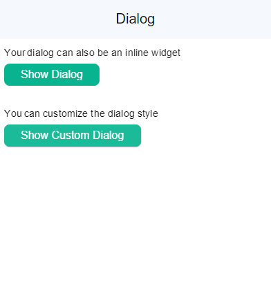
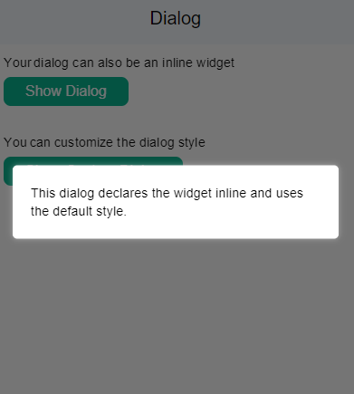
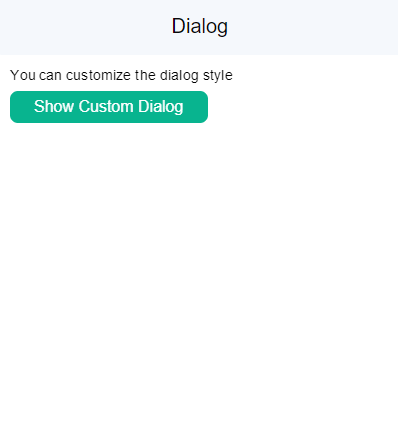
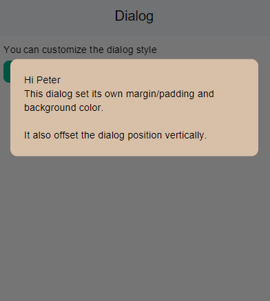

# Action: showDialog

showDialog action triggers the display of a modal dialog box within the app, presenting users with important information, notifications, or customizable content while pausing the main app flow, ensuring clear and focused communication with users.

### Properties

| Property        | Type   | Description                                                                     |
| :-------------- | :----- | :------------------------------------------------------------------------------ |
| widget          | widget | Return an inline widget or specify a custom widget's name to use in the dialog. |
| options         | object | [see properties](#propertiesoptions)                                            |
| onDialogDismiss | action | Execute an Action when the dialog is dismissed.                                 |

#### properties.options

| Property         | Type    | Description                                                                                                                                                                           |
| :--------------- | :------ | :------------------------------------------------------------------------------------------------------------------------------------------------------------------------------------ |
| minWidth         | integer |                                                                                                                                                                                       |
| maxWidth         | integer |                                                                                                                                                                                       |
| minHeight        | integer |                                                                                                                                                                                       |
| horizontalOffset | number  | Offset the dialog's position horizontally, with -1.0 for the screen's left and 1.0 for the screen's right. (default is 0 for centering horizontally) minimum `-1.0` and maximum `1.0` |
| verticalOffset   | number  | Offset the dialog's position vertically, with -1.0 for the screen's top and 1.0 for the screen's bottom. (default is 0 for centering vertically) minimum `-1.0` and maximum `1.0`     |
| style            | string  | Render the dialog with a default style. You can also specify 'none' and control your own styles in your widget. `default` `none`                                                      |

**Example**

Here we are gonna see how we can

<div class="code-container" markdown=1>
  <button onclick="copyCode()" class="copy-code-button">Copy Code</button>

```yaml
View:
  header:
    title: Dialog
  onLoad:
    showDialog:
      widget: MyStartingDialog

  body:
    Column:
      styles: { margin: 10, gap: 5 }
      children:
        # use inline widget
        - Text:
            text: Your dialog can also be an inline widget
        - Button:
            label: Show Dialog
            onTap:
              showDialog:
                widget:
                  Text:
                    text: This dialog declares the widget inline and uses the default style.

        - Spacer:
            styles:
              size: 20

        # use custom styling
        - Text:
            text: You can customize the dialog style
        - Button:
            label: Show Custom Dialog
            onTap:
              showDialog:
                widget: MyCustomDialog
                options:
                  # no default style - zero margin/padding, no background color
                  style: none
                  # move it up half way between the top and the center of the screen
                  verticalOffset: -0.5

# Custom Widget
MyStartingDialog:
  body:
    Column:
      styles:
        gap: 10
      children:
        - Text:
            text: Welcome to Ensemble
            styles:
              fontSize: 16
              fontWeight: bold
        - Text:
            text: This dialog pops up when the user first visits the page.
        - Button:
            label: Close dialog
            onTap: closeAllDialogs

MyCustomDialog:
  body:
    Column:
      styles:
        gap: 10
        backgroundColor: 0xffD7BFA8
        borderRadius: 10
        margin: 20
        padding: 20
      children:
        - Text:
            text: |-
              This dialog set its own margin/padding and background color.

              It also offset the dialog position vertically.
```

Try complete example [here](https://studio.ensembleui.com/app/e24402cb-75e2-404c-866c-29e6c3dd7992/screen/HRIajN2i8bDDVTL32j8m?propertyPanelEnabled=true&instantPreviewDisabled=false&editorV2Enabled=true)

</div>

**Output**





**Example with inputs**

We can also make use of inputs property for `showDialog` action to pass any input parameters to be used with dialog. Lets look at the previous example but this time with some input values.

```yaml
View:
  header:
    title: Dialog
  onLoad:
    showDialog:
      widget: MyStartingDialog
  body:
    Column:
      styles: { margin: 10, gap: 5 }
      children:
		- Text:
            text: You can customize the dialog style and provide inputs as well
        - Button:
            label: Show Custom Dialog
            onTap:
              showDialog:
                widget:
                  MyCustomDialog:
                    inputs:
                      name: Peter
                options:
                  # no default style - zero margin/padding, no background color
                  style: none
                  # move it up half way between the top and the center of the screen
                  verticalOffset: -0.5

                onDialogDismiss: |
                  //@code
                  console.log("dialog dismissed");

MyCustomDialog:
  inputs:
    - name
  body:
    Column:
      styles:
        gap: 10
        backgroundColor: 0xffD7BFA8
        borderRadius: 10
        margin: 20
        padding: 20
      children:
        - Text:
            text: |-
              Hi ${name}
              This dialog set its own margin/padding and background color.

              It also offset the dialog position vertically.
```

**Explanation**

- In the code for showDialog we are passing an input `name` with value `Peter` which can be seen clearly in the output.

**Output**




