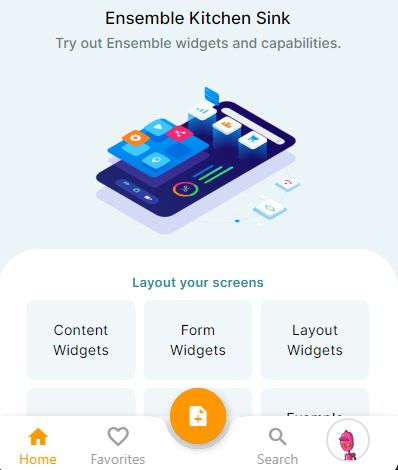
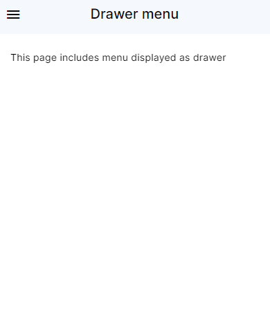
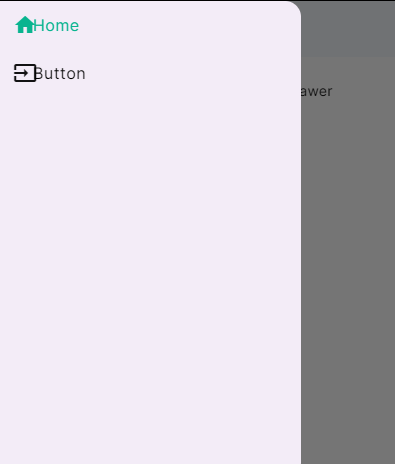
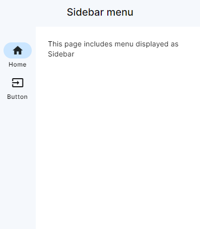
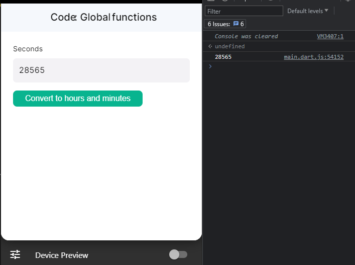
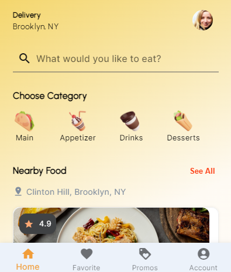

# Ensemble Page Structure

An Ensemble app comprises a series of pages and assets. Each page starts with a [View](#view), followed by an optional [header](#header), an optional [menu](#menu), and a single widget for the body. There can be one of two things on ensemble page either a [View](#view) or group of multiple views together as [ViewGroup](#view-group).

List of things you will find reference and details here.

- [View](#view)
- [ViewGroup](#view-group)
- [header](#header)
- [Menu](#menu)
- [Body](#body)
- [API](#api)
- [Global](#global)


## View Group

The ViewGroup widget allows you to group multiple Views together and organize them behind a menu, such as a Drawer, EndDrawer, BottomNavBar, SideBar, or EndSidebar. This provides a convenient way to create structured layouts and navigation within your application.

### Example

Let's look at an example with a `Bottom Navigation Bar` menu type.

<div class="code-container" markdown=1>
  <button onclick="copyCode()" class="copy-code-button">Copy Code</button>

```yaml
ViewGroup:
  BottomNavBar:
    styles:
      backgroundColor: white
    items:
      - icon: search
        label: Search
        page: Home
      - icon: assignment
        label: Appointments
        page: MyAppointments
      - icon: list
        label: My Doctors
        page: MyDoctors
      - icon: account_circle
        label: Profile
        page: Profile
```

</div>

Check it out in [studio](https://studio.ensembleui.com/app/3vEZBIhDyYnIQo6BLN2O/screen/Wewvp6ZUyb0PBwkTAltQ?propertyPanelEnabled=true&instantPreviewDisabled=false)

##### Output


## View

The View widget defines the overall structure of a page, including properties like header, body and more, to create a cohesive layout and presentation within your application. View requires only body while other components like [header](#header) and [menu](#menu) are optional.

#### Properties

| Property | Type   | Description                                                                      |
| :------- | :----- | :------------------------------------------------------------------------------- |
| header   | object | [details](#header)                                                               |
| body     | object | [details](#body)                                                                 |
| onLoad   | action | Execute an Action from a set of pre-defined set of actions when the screen loads |
| options  | string | Specify if this is a `regular` (default) or `modal` screen.                      |
| styles   | object | [see properties](#viewstyles)                                                    |

#### View.styles

| Property               | Type                                                       | Description                                                                                                                                                                                                                                                                                                                          |
| :--------------------- |:-----------------------------------------------------------|:-------------------------------------------------------------------------------------------------------------------------------------------------------------------------------------------------------------------------------------------------------------------------------------------------------------------------------------|
| backgroundColor        | [Color](/widget-reference/types#Color)                     | Background color for the screen starting with '0xFF' for full opacity e.g 0xFFCCCCCC. It can be specified as a number, a predefined color name, or a hexadecimal value starting with '0x'. `transparent` `black` `blue` `white` `red` `grey` `teal` `amber` `pink` `purple` `yellow` `green` `brown` `cyan` `indigo` `lime` `orange` |
| backgroundImage        | [BackgroundImage](/widget-reference/types#BackgroundImage) | Background image of the View.                                                                                                                                                                                                                                                                                                        |
| useSafeArea            | boolean                                                    | Applicable only when we don't have a header. If true, insert paddings around the body content to account for the the devices' Safe Area (e.g. iPhone notch). Default is false.                                                                                                                                                       |
| scrollableView         | boolean                                                    | Specify if the content of this screen is scrollable with a global scrollbar. Using this also allow you to customize the scrolling experience of the header.                                                                                                                                                                          |
| showNavigationIcon     | boolean                                                    | For a screen with header, the App will automatically show the Menu, Back, or Close icon (for modal screen) before the title. On modal screen without the header, the Close icon will be shown. Set this flag to false if you wish to hide the icons and handle the navigation yourself.                                              |
| navigationIconPosition | string                                                     | On modal screen without a header, you can position the close button at the `start` or `end` of the screen. For left-to-right languages like English, start is on the left and end is on the right. This property has no effect on a screen with header.                                                                              |

## Header

The header contains the Safe Area (e.g. iPhone notch) and by default has the background color of your theme's primaryColor. It includes:

1. `navigation icon`. If a drawer menu is used the system will automatically show an icon to open/close the drawer, otherwise if this page can navigate back to the previous page, the back arrow will be shown. If neither condition is true, the icon will not be visible, in which case the title will stretch to fill the entire horizontal space.
2. `title`. Its simplest form is a string which is the title text. You may override it with a custom widget.
3. `flexible background`. Specifies a widget that will fill the entire header (including the notch). This is typically used as a background for the header. This widget will be laid out first, with the navigation icon and the title overlay on top.

#### Properties

| Property           | Type                                 | Description                                                                                                                                                                                                                           |
|:-------------------|:-------------------------------------|:--------------------------------------------------------------------------------------------------------------------------------------------------------------------------------------------------------------------------------------|
| titleText          | string                               | The title for the screen                                                                                                                                                                                                              |
| titleWidget        | [Widget](widget-reference/directory) | Render this widget as the screen title                                                                                                                                                                                                |
| styles             | object                               | [see properties](#headerstyles)                                                                                                                                                                                                       |
| flexibleBackground | [Widget](widget-reference/directory) | This widget (typically used as an background image) acts as the header's background, with the title bar and the bottom widget overlaid on top. On non-scrollable screen, its dimensions is dictated by the header's width and height. |

#### Header.styles

| Property          | Type                                   | Description                                                                                                                                                                                                                                                                                                                                                                    |
| :---------------- |:---------------------------------------| :----------------------------------------------------------------------------------------------------------------------------------------------------------------------------------------------------------------------------------------------------------------------------------------------------------------------------------------------------------------------------- |
| backgroundColor   | [Color](/widget-reference/types#Color) | By default the background color uses the theme's 'primary' color. You can override the header's background color here. It can be specified as a number, a predefined color name, or a hexadecimal value starting with '0x'. `transparent` `black` `blue` `white` `red` `grey` `teal` `amber` `pink` `purple` `yellow` `green` `brown` `cyan` `indigo` `lime` `orange`          |
| color             | [Color](/widget-reference/types#Color) | By default the navigation icon, title, and action icons uses the theme's 'onPrimary' color. You can override their colors here. It can be specified as a number, a predefined color name, or a hexadecimal value starting with '0x'. `transparent` `black` `blue` `white` `red` `grey` `teal` `amber` `pink` `purple` `yellow` `green` `brown` `cyan` `indigo` `lime` `orange` |
| elevation         | integer                                | Raise the header on its z-coordinates relative to the body. This effectively creates a drop shadow on the header's bottom edge. Minimum value: 0, Maximum value: 24                                                                                                                                                                                                            |
| shadowColor       | [Color](/widget-reference/types#Color) | If elevation is non-zero, this will override the drop shadow color of the header's bottom edge, starting with '0xFF' for full opacity. `transparent` `black` `blue` `white` `red` `grey` `teal` `amber` `pink` `purple` `yellow` `green` `brown` `cyan` `indigo` `lime` `orange`                                                                                               |
| centerTitle       | boolean                                | Whether to align the title in the title bar's center horizontally (default: true)                                                                                                                                                                                                                                                                                              |
| titleBarHeight    | integer                                | For consistency, the header's title bar has the default fixed height of 56 regardless of its content. You may adjust its height here. Minimum value is `0`                                                                                                                                                                                                                     |
| flexibleMinHeight | integer                                | Applicable only if scrollableView is enabled. This attribute effectively sets the header's min height on scrolling (header's height will varies between the flexibleMinHeight and flexibleMaxHeight). Note that this attribute will be ignored if smaller than the titleBarHeight                                                                                              |
| flexibleMaxHeight | integer                                | Applicable only if scrollableView is enabled. This attribute effectively sets the header's max height on scrolling (header's height will varies between the flexibleMinHeight and flexibleMaxHeight). This attribute will be ignored if smaller than the flexibleMinHeight                                                                                                     |

Note: when the entire View is specified as scrollable, flexible background's height can vary in height (hence flexible) on scroll with a parallax effect.

## Menu

Ensemble provides support for five menu types that offer extensive customization options, including the ability to add custom items which are indeed `custom widgets`. These menu types allow users to meet their unique design needs or client requirements. Below, you will find detailed information about each menu type, including the supported properties, styles, and illustrative examples for better understanding.

### BottomNavBar

This is the navigation bar at the bottom of the screen, typical of most iOS and Android apps. Where each item has several properties as explained [below](#bottomnavbaritems).

#### BottomNavBar.Properties

| Property | Type             | Description                                                          |
| :------- | :--------------- | :------------------------------------------------------------------- |
| items    | array of objects | List of menu items (minimum 2). [see properties](#bottomnavbaritems) |
| styles   | object           | [see properties](#bottomnavbarstyles)                                |

#### BottomNavBar.items

| Property                | Type              | Description                                                                                                                                                                                                                                                                                                                          |
| :---------------------- | :---------------- | :----------------------------------------------------------------------------------------------------------------------------------------------------------------------------------------------------------------------------------------------------------------------------------------------------------------------------------- |
| icon                    | string            | Icon name from ` Material Icons``Font Awesome``Remix ` or `custom font icons`.                                                                                                                                                                                                                                                       |
| iconLibrary             | string            | Enables the usage of various icon libraries like `FontAwesome`, `Remix`, `Material Icons` or `custom icon` fonts within ensemble.                                                                                                                                                                                                    |
| label                   | string            | Defines the text displayed below the icon, providing a descriptive title or name for the menu item                                                                                                                                                                                                                                   |
| page                    | string            | The new page to navigate to on click                                                                                                                                                                                                                                                                                                 |
| selected                | string            | Mark this item as selected. There should only be one selected item per page.                                                                                                                                                                                                                                                         |
| floating                | boolean           | Mark this item as a floating icon                                                                                                                                                                                                                                                                                                    |
| floatingMargin          | integer or string | The margin around the floating.                                                                                                                                                                                                                                                                                                      |
| floatingAlignment       | string            | How to align the floating in the BottomNavBar. The values are ` left``center``right ` and `none`                                                                                                                                                                                                                                     |
| color                   | [Color](/widget-reference/types#Color) | Unselected icon color, starting with '0xFF' for full opacity e.g 0xFFCCCCCC. It can be specified as a number, a predefined color name, or a hexadecimal value starting with '0x'. `transparent` `black` `blue` `white` `red` `grey` `teal` `amber` `pink` `purple` `yellow` `green` `brown` `cyan` `indigo` `lime` `orange`          |
| selectedColor           | [Color](/widget-reference/types#Color) | Selected icon color, starting with '0xFF' for full opacity e.g 0xFFCCCCCC. It can be specified as a number, a predefined color name, or a hexadecimal value starting with '0x'. `transparent` `black` `blue` `white` `red` `grey` `teal` `amber` `pink` `purple` `yellow` `green` `brown` `cyan` `indigo` `lime` `orange`            |
| backgroundColor         | [Color](/widget-reference/types#Color) | Background color of the box. which can be represented in different formats. It can be specified as a number, a predefined color name, or a hexadecimal value starting with '0x'. `transparent` `black` `blue` `white` `red` `grey` `teal` `amber` `pink` `purple` `yellow` `green` `brown` `cyan` `indigo` `lime` `orange`           |
| floatingBackgroundColor | [Color](/widget-reference/types#Color) | Floating item background color, starting with '0xFF' for full opacity e.g 0xFFCCCCCC. It can be specified as a number, a predefined color name, or a hexadecimal value starting with '0x'. `transparent` `black` `blue` `white` `red` `grey` `teal` `amber` `pink` `purple` `yellow` `green` `brown` `cyan` `indigo` `lime` `orange` |
| floatingIconColor       | [Color](/widget-reference/types#Color) | Floating item icon color, starting with '0xFF' for full opacity e.g 0xFFCCCCCC. It can be specified as a number, a predefined color name, or a hexadecimal value starting with '0x'. `transparent` `black` `blue` `white` `red` `grey` `teal` `amber` `pink` `purple` `yellow` `green` `brown` `cyan` `indigo` `lime` `orange`       |
| customItem              | object            | Allows user to use custom widgets for two states `selected` and `UnSelected`.                                                                                                                                                                                                                                                        |

##### BottomNavBar.items.customItem

| Property       | Type   | Description                                            |
| :------------- | :----- | :----------------------------------------------------- |
| widget         | [Widget](widget-reference/directory) | Custom bottom navigation item for the unselected state |
| selectedWidget | [Widget](widget-reference/directory) | Custom bottom navigation item for the selected state   |

#### BottomNavBar.styles

| Property        | Type              | Description                                                                                                                                                                                                                                                                                                                |
| :-------------- | :---------------- | :------------------------------------------------------------------------------------------------------------------------------------------------------------------------------------------------------------------------------------------------------------------------------------------------------------------------- |
| backgroundColor | [Color](/widget-reference/types#Color) | Background color of the box. which can be represented in different formats. It can be specified as a number, a predefined color name, or a hexadecimal value starting with '0x'. `transparent` `black` `blue` `white` `red` `grey` `teal` `amber` `pink` `purple` `yellow` `green` `brown` `cyan` `indigo` `lime` `orange` |

#### Example

<div class="code-container" markdown=1>
  <button onclick="copyCode()" class="copy-code-button">Copy Code</button>

```yaml
BottomNavBar:
  styles:
    backgroundColor: white
    color: grey
    selectedColor: orange
    floatingBackgroundColor: orange
    floatingIconColor: white
  items:
    - label: Home
      activeIcon: home
      icon: home
      page: Home

    - customItem:
        widget: CustomNavBarItem
        selectedWidget: ActiveCustomNavBarItem
      page: Icon

    - icon: note_add
      floating: true
      floatingAlignment: center
      floatingMargin: 5
      onTap: |
        //@code
        ensemble.navigateScreen('Lottie');

    - icon: search
      label: Search
      page: Image

    - customItem:
        widget: CustomNavBarItemWithImage
        selectedWidget: ActiveCustomNavBarItemWithImage
      page: WeeklyScheduler
```

</div>

This sippet has example for how user can utilize

1. Custom widgets as items for the menu
2. Floating icons

you can check the complete example [here](https://studio.ensembleui.com/app/e24402cb-75e2-404c-866c-29e6c3dd7992/screen/aa634599-cd5d-411c-a4b6-1163f3b5c558).

##### Output



### Drawer

This menu type puts the menu behind a drawer icon on the header. The drawer icon will be positioned to the 'start' of the header (left for most languages, right for RTL languages).

#### Drawer.Properties

| Property | Type             | Description                                                    |
| :------- | :--------------- | :------------------------------------------------------------- |
| header   | widget           | The header widget for the menu                                 |
| footer   | widget           | The footer widget for the menu                                 |
| items    | array of objects | List of menu items (minimum 2). [see properties](#draweritems) |
| styles   | object           | [see properties](#drawerstyles)                                |

#### Drawer.items

| Property    | Type   | Description                                                                                                                       |
| :---------- | :----- | :-------------------------------------------------------------------------------------------------------------------------------- |
| icon        | string | Icon name from ` Material Icons``Font Awesome``Remix ` or `custom font icons`.                                                    |
| iconLibrary | string | Enables the usage of various icon libraries like `FontAwesome`, `Remix`, `Material Icons` or `custom icon` fonts within ensemble. |
| label       | string | Defines the text displayed below the icon, providing a descriptive title or name for the menu item                                |
| page        | string | The new page to navigate to on click                                                                                              |
| selected    | string | Mark this item as selected. There should only be one selected item per page.                                                      |

#### Drawer.styles

| Property        | Type              | Description                                                                                                                                                                                                                                                                                                                |
| :-------------- | :---------------- | :------------------------------------------------------------------------------------------------------------------------------------------------------------------------------------------------------------------------------------------------------------------------------------------------------------------------- |
| backgroundColor | integer or string | Background color of the box. which can be represented in different formats. It can be specified as a number, a predefined color name, or a hexadecimal value starting with '0x'. `transparent` `black` `blue` `white` `red` `grey` `teal` `amber` `pink` `purple` `yellow` `green` `brown` `cyan` `indigo` `lime` `orange` |

#### Example

It is a basic usage example for the Drawer menu.

<div class="code-container" markdown=1>
  <button onclick="copyCode()" class="copy-code-button">Copy Code</button>

```yaml
View:
  title: Drawer menu
  menu:
    Drawer:
      items:
        - label: Home
          icon: home
          page: Home
        - label: Button
          icon: input
          page: Button

  Column:
    styles: { gap: 16, padding: 24, scrollable: true }
    children:
      - Markdown:
          text: |
            This page includes menu displayed as drawer
```

</div>

You can also check live example [here](https://studio.ensembleui.com/app/e24402cb-75e2-404c-866c-29e6c3dd7992/screen/0073ebe9-6b0b-4ebf-9e8b-72a93a1275df#)

##### Output




### End Drawer

Similar to Drawer but the drawer icon will be positioned to the 'end' of the header (right for most languages, left for RTL languages). You can check its properties [here](#drawerproperties). You can find its example in [Kitchen Sink](https://studio.ensembleui.com/app/e24402cb-75e2-404c-866c-29e6c3dd7992/screen/YIcCi9aXiGJKftQRNi34#)

### SideBar

A fixed navigation menu to the 'start' of the screen (left for most languages, right for RTL languages). The menu may become a drawer menu on lower resolution or screen sizes.

#### Sidebar.Properties

| Property | Type             | Description                                                     |
| :------- | :--------------- | :-------------------------------------------------------------- |
| header   | widget           | The header widget for the menu                                  |
| footer   | widget           | The footer widget for the menu                                  |
| items    | array of objects | List of menu items (minimum 2). [see properties](#sidebaritems) |
| styles   | object           | [see properties](#sidebarstyles)                                |

#### Sidebar.items

| Property    | Type   | Description                                                                                                                       |
| :---------- | :----- | :-------------------------------------------------------------------------------------------------------------------------------- |
| icon        | string | Icon name from ` Material Icons``Font Awesome``Remix ` or `custom font icons`.                                                    |
| iconLibrary | string | Enables the usage of various icon libraries like `FontAwesome`, `Remix`, `Material Icons` or `custom icon` fonts within ensemble. |
| label       | string | Defines the text displayed below the icon, providing a descriptive title or name for the menu item                                |
| page        | string | The new page to navigate to on click                                                                                              |
| selected    | string | Mark this item as selected. There should only be one selected item per page.                                                      |

#### Sidebar.styles

| Property        | Type              | Description                                                                                                                                                                                                                                                                                                                |
| :-------------- | :---------------- | :------------------------------------------------------------------------------------------------------------------------------------------------------------------------------------------------------------------------------------------------------------------------------------------------------------------------- |
| backgroundColor | integer or string | Background color of the box. which can be represented in different formats. It can be specified as a number, a predefined color name, or a hexadecimal value starting with '0x'. `transparent` `black` `blue` `white` `red` `grey` `teal` `amber` `pink` `purple` `yellow` `green` `brown` `cyan` `indigo` `lime` `orange` |
| borderWidth     | integer           | The thickness of the border                                                                                                                                                                                                                                                                                                |
| borderColor     | integer or string | Color of the border, which can be represented in different formats. It can be specified as a number, a predefined color name, or a hexadecimal value starting with '0x'. `transparent` `black` `blue` `white` `red` `grey` `teal` `amber` `pink` `purple` `yellow` `green` `brown` `cyan` `indigo` `lime` `orange`         |
| itemDisplay     | string            | How to render each navigation item. `stacked` `sideBySide`                                                                                                                                                                                                                                                                 |
| itemPadding     | integer or string | Padding for each navigation item with CSS-style value                                                                                                                                                                                                                                                                      |
| minWidth        | integer           | The minimum width for the menu (default 200)                                                                                                                                                                                                                                                                               |

#### Example

An example on how to use Sidebar menu.

<div class="code-container" markdown=1>
  <button onclick="copyCode()" class="copy-code-button">Copy Code</button>

```yaml
View:
  title: Sidebar menu
  menu:
    Sidebar:
      items:
        - label: Home
          icon: home
          page: Home
        - label: Button
          icon: input
          page: Button

  Column:
    styles: { gap: 16, padding: 24, scrollable: true }
    children:
      - Markdown:
          text: |
            This page includes menu displayed as Sidebar
```

</div>

You can also check live example [here](https://studio.ensembleui.com/app/e24402cb-75e2-404c-866c-29e6c3dd7992/screen/QZyoRkHHrHEAkGJMwoNU#)

##### Output



## Body

The View requires a single widget defined as its child. This will act as the body content, and can only be a Column, Row, Flex, or Stack widget.

## API

API provides a convenient way to interact with external services or data sources, allowing developers to make HTTP requests, access data, and integrate various functionalities into their applications.

#### Properties

| Property   | Type   | Description                                                                     |
| :--------- | :----- | :------------------------------------------------------------------------------ |
| method     | String | The HTTP method of the request, such as `GET`, `POST`, `DELETE`, `PUT`, `PATCH` |
| uri        | String | The URI for the request                                                         |
| body       | Object | The request body                                                                |
| headers    | Object | The headers for the request                                                     |
| onResponse | Action | The action to handle the response                                               |
| onError    | Action | The action to handle errors                                                     |
| inputs     | Array  | The input values                                                                |

You can find many great example [here](/actions/1-invokeAPI)

## Global

Global enables users to declare or define functions and variables which can be accessed globally inside the whole screen in every widget. In simple words its scope ig `global` just like a normal JavaScript `Global Execution Context` where users can access these functions anywhere in the screen.

**Example**

```yaml
View:
  header:
    title: "Code: Global functions"
  styles:
    scrollableView: true
  Column:
    styles: { gap: 16, padding: 24 }
    children:
      - TextInput:
          id: secondsInput
          label: Seconds
          value: 28565
      - Button:
          label: Convert to hours and minutes
          onTap:
            executeCode:
              body: |-
                //@code
                results.text = convertSecondsToHours(secondsInput.value);

      - Text:
          id: results

Global: |-

  function convertSecondsToHours (s) {

    console.log(s);
  }
```

**Output**

The output can be checked in the logs for browser



## Putting it together

This example illustrates almost all the widgets which are integral part of ensemble page structure. It also demonstrates a comprehensive usage of BottomNavBar, onLoad action, API calls and custom widgets.

<div class="code-container" markdown=1>
  <button onclick="copyCode()" class="copy-code-button">Copy Code</button>

```yaml
View:
  onLoad:
      invokeAPI:
        name: getUser
        inputs:
          id: 32GelurbLbd6umj3ULOkAXYSYyq2

  # Set the view to be scrollable
  styles:
    scrollableView: true
menu:
    BottomNavBar:
      styles:
        shadowColor: 0xFFFD451C
      items:
        - icon: home
          label: Home
          page: Home
          selected: true
        - label: Favorite
          icon: favorite
          page: Favorite
        - label: Promos
          icon: loyalty
          page: Promos
        - label: Account
          icon: account_circle
          page: Profile

  # This is the parent widget for all screen content
  body:
    Column:
      styles:
        backgroundGradient:
          colors: [ 0xFFF4D66C, 0xFFFEFAF3, 0xFFFFFFFF ]
          start: topLeft
          end: bottomRight

      children:
        - UserInfo
        - SearchBar
        - Categories
        - NearbyFood
```

</div>

#### Output



You can check the complete App [here](https://studio.ensembleui.com/app/iM58Wgr7bgzTxEi7rV40/screen/cYMnCfhOya8Vq1QG6aCC?propertyPanelEnabled=true&instantPreviewDisabled=false)
