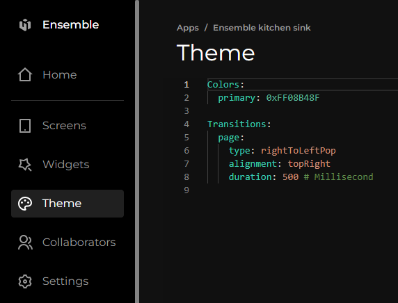

# Theme

Welcome to our Theme page, your gateway to a world of visual customization! Here, we'll explore the powerful elements that make up our platform's themes. From color schemes to typography, widgets, and transition options, our comprehensive range of theme elements allows you to effortlessly personalize your app. Discover how themes can transform your online presence, create a cohesive brand identity, and provide a delightful user experience. Unlock the full potential of your app with our versatile and user-friendly theme customization features. Let's wait no further and jump right into the details.

[Kitchen Sink Example](https://studio.ensembleui.com/app/e24402cb-75e2-404c-866c-29e6c3dd7992/theme)

## Where to find it ?

You can find the theme on Left-Side of the panel in ensemble studio after you have selected your App.



For instance in my case for Ensemble Kitchen Sink as you can see the Theme selected in the picture above.

## Checking and Switching Themes in Javascript
```javascript
var themes = app.themes; //returns a list of all configured themes
var currentTheme = app.theme; //currently applied theme
app.theme = 'newTheme'; //change themes dynamically. The theme name must be in the list of Themes in the theme definition.
```
In the following EDL, a `DropDown` widget is bound to the list of `themes` that have been configured in the app and allows user to swtich from one theme to another. 

**Example:**

Bind the `themes` to a dropdown and let user switch themes from all the available themes. 
```yaml
        - Dropdown:
            label: Pick a Theme
            items: ${app.themes}
            value: ${app.theme}
            onChange:
              executeCode:
                body: |
                  app.theme = this.value;
```

## Savings themes in storage so they can be applied across application sessions
A common requirement from theming is to be able to persist a theme that user has selected across multiple application sessions i.e. even when the user kills the app and relaunches, the theme s/he selected should automatically apply. Ensemble provides that capability by storing themes in local storage. 

At application startup time, Ensemble platform checks if there is a saved theme and if that theme exists in the list of theme definitions. If both conditions are true, it automatically applies the saved theme instead of the default theme configured in the app. 

Application developers have the following functions available to them. 
```javascript
//save theme in storage, this will automatically be applied by the platform on startup
//note that saveTheme does NOT apply a theme, it merely saves it. use app.theme = 'myNewTheme'; to change themes dynamically, 
app.saveTheme('myNewTheme');
//retrieve the saved theme
var savedTheme = app.getSavedTheme(); //there can only be one saved theme
//or remove the saved theme from storage
app.removeSavedTheme();
```

## Text Styles are automatically inherited unless overriden
All text styles (for example - `fontSize`, `fontFamily`, `color` etc) can be defined at the `View`, `Column`, `Row` or any of the top widget level and will automatically be inherited by all `Text` widgets. Note that labels for `Button` etc do not inherit these styles. 

**Example:**
```yaml
View:
  className: topView
#rest of your screen definition
```
And over in your Theme
```yaml
  Styles:
    .topView:
      backgroundColor: ${Colors.gray['200']}
      textStyle:
        fontWeight: ${Typography.fontWeight['700']}
        fontSize: ${Typography.fontSize['xl']}
```
All `Text` in the screen will inherit these text styles. You can specify the style at the `View` node and then all Text widgets across your whole app would inherit those text styles

## Parts of a Theme

- Tokens (optional)
- Styles (in precedence order)
  - Inline - specified directly on the widget
  - ID based - specified with `#` before the name in the Theme.Styles
  - Style Classes - specified as `className` attribute on a widget. One or more space delimited classes
  - Widget type - specified for the widget type such as Button in the Theme.Styles
  - Inherited from parent - these are limited to `textStyle` only (see above)
 
Here's an explanation of the different parts of a theme:

**1. Tokens (Optional):**

Tokens are named collections of values typically used for colors, fonts, and spacing. They provide a way to define reusable values across your theme and avoid code duplication. These tokens are then used inside the `Styles` with the expression syntax, for example `${Colors.gray['200']}`

**Example:**

```yaml
Light:
  label: Light Theme
  description: This theme turns everything light as in white background and is default
  inheritsFrom: Common
  Tokens:
    Colors:
      teal:
        '900': '#014451'
        '800': '#05505C'
        '700': '#036672'
        '600': '#047481'
        '500': '#0694A2'
        '400': '#16BDCA'
        '300': '#7EDCE2'
        '200': '#AFECEF'
        '100': '#D5F5F6'
        '50': '#EDFAFA'      
  Styles:
    Button:
      borderRadius: 20
    .submit:
      backgroundColor: ${Colors.teal['800']}
      labelStyle:
        color: white
        fontFamily: ${Typography.fontFamily}
```

**2. Styles (Precedence Order):**

Styles define how different UI elements will appear. Ensemble applies styles based on their **precedence**, with higher precedence styles overriding lower ones. Here's the order of precedence, from highest to lowest:

* **Inline Styles:** Styles defined directly on the widget using the `style` attribute.
* **Style Classes:** Styles defined in the theme and applied to a widget using the `className` attribute (space-separated list of classes). 
* **ID-based Styles:** Styles defined in the theme using an ID selector (preceded by `#`).
* **Widget Type Styles:** Styles defined for a specific widget type (e.g., `Button`).

**Example of Styles defined in a Theme:**

```yaml
Light:
 Styles:
  # ID-based style
  '#heading':
    fontSize: 24
    fontWeight: bold

  # Widget type style
  Button:
    backgroundColor: ${Colors.primary}
    color: white

  # Style class
  .error:
    color: red
```
**Example of Inline styles and specifying classes**
```yaml
Button:
  styles:
    backgroundColor: red
  className: commonButton submitButton #here two classes are applied in order i.e. the styles defines in the list of classes are merged in the order they are specified.
```
**Specificity:**

Similar to CSS, styles in Ensemble with higher specificity will override those with lower specificity. Specificity is determined by the number and type of selectors used in the style definition. Inline styles and styles specified by the ID-based styles have the highest specificity, followed by classes and then widget type styles.

By understanding the different parts of a theme and how inheritance and specificity work, you can create well-structured, maintainable, and reusable themes for your Ensemble applications.

## Theme Inheritance in Ensemble

Ensemble allows you to create reusable and organized themes using inheritance, similar to how CSS works. This lets you define common styles in a base theme and then have other themes inherit and modify those styles as needed.

### Benefits of Theme Inheritance

* **Reduces code duplication:** Define common styles once in a base theme and avoid repeating them in other themes.
* **Improved maintainability:** Makes changes to common styles easier to manage as they are centralized in the base theme.
* **Theming hierarchy:** Build a clear hierarchy of themes, making it easier to understand how styles are applied.

### How Inheritance Works

1. **Base Theme:** Define a theme (e.g., `Common`) containing the styles you want to share with other themes. You can define multiple base themes
2. **Inheriting Theme:** Define another theme (e.g., `Light`) and specify the base theme it inherits from using the `inheritsFrom` property. A base theme may inherit from another theme forming a chain
3. **Overriding Styles:** The inheriting theme can override any styles from the base theme by defining the same styles with different values.

### Example

Here's an example demonstrating theme inheritance:

**Common Theme:**

```yaml
Common:
  label: Common theme
  Tokens:
    Colors:
      primary: '#0077B8'
      gray:
        '200': '#f2f2f2'
        '300': '#e0e0e0'
  Styles:
    .topView:
      backgroundColor: ${Colors.gray['200']}
    Button:
      borderRadius: 20
      backgroundColor: red
```

**Light Theme (inherits from Common):**

```yaml
Light:
  label: Light Theme
  description: Light theme with white background
  inheritsFrom: Common
  Tokens:
    Colors:
      teal:  # New color palette for Light theme
        '500': '#0694A2'
  Styles:
    Button:
      backgroundColor: ${Colors.teal['500']}  # Inherits primary from Common and overrides with teal
      labelStyle:
        color: white
```

**Explanation:**

* `Light` theme inherits styles and tokens from the `Common` theme.
* `Light` theme overrides the `backgroundColor` of the `Button` style with its own `teal` color.
* `Light` theme's `Button` inherits the `borderRadius` from `Common` theme
* Other styles from `Common` (like `.topView`) are still applied to the `Light` theme.

This example demonstrates how you can define a common base theme and then create specific themes like `Light` and `Dark` that inherit and modify styles as needed.


### Properties

Now let us see what properties does it have on larger level

| Property    | Type    | Description                                                                                                                                                     |
| :---------- | :------ | :-------------------------------------------------------------------------------------------------------------------------------------------------------------- |
| material3   | boolean | If set true, material3 will be applied else material2. see [here](https://material.io/blog/migrating-material-3) for more details about Material Design 2 vs 3. |
| Text        | object  | [see properties](#text)                                                                                                                                         |
| Colors      | object  | [see properties](#colors)                                                                                                                                       |
| Widgets     | object  | [see properties](#widgets)                                                                                                                                      |
| Transitions | object  | [see properties](#transitions)                                                                                                                                  |

### Text

| Property       | Type   | Description                                                                                                                                                                                                                                        |
| :------------- | :----- | :------------------------------------------------------------------------------------------------------------------------------------------------------------------------------------------------------------------------------------------------- |
| fontFamily     | string | Allows users to chose a specific font-family other than the default one. see the list of all available font families [here](https://github.com/material-foundation/flutter-packages/blob/main/packages/google_fonts/generator/families_supported). |
| displayLarge   | object | Largest of display styles . As the largest text on the screen, display styles are reserved for short, important text or numerals. They work best on large screens. [see properties](#textstyle)                                                    |
| displayMedium  | object | Middle size of the display styles. As the largest text on the screen, display styles are reserved for short, important text or numerals. They work best on large screens. [see properties](#textstyle)                                             |
| displaySmall   | object | Smallest of the display styles. As the largest text on the screen, display styles are reserved for short, important text or numerals. They work best on large screens. [see properties](#textstyle)                                                |
| headlineLarge  | object | Largest of the headline styles. Headline styles are smaller than display styles. They're best-suited for short, high-emphasis text on smaller screens. [see properties](#textstyle)                                                                |
| headlineMedium | object | Middle size of the headline styles. Headline styles are smaller than display styles. They're best-suited for short, high-emphasis text on smaller screens.[see properties](#textstyle)                                                             |
| headlineSmall  | object | Smallest of the headline styles. Headline styles are smaller than display styles. They're best-suited for short, high-emphasis text on smaller screens. [see properties](#textstyle)                                                               |
| titleLarge     | object | Largest of the title styles. Titles are smaller than headline styles and should be used for shorter, medium-emphasis text.[see properties](#textstyle)                                                                                             |
| titleMedium    | object | Middle size of the title styles. Titles are smaller than headline styles and should be used for shorter, medium-emphasis text. [see properties](#textstyle)                                                                                        |
| titleSmall     | object | Smallest of the title styles. Titles are smaller than headline styles and should be used for shorter, medium-emphasis text. [see properties](#textstyle)                                                                                           |
| bodyLarge      | object | Largest of the body styles. Body styles are used for longer passages of text. [see properties](#textstyle)                                                                                                                                         |
| bodyMedium     | object | Middle size of the body styles. Body styles are used for longer passages of text. [see properties](#textstyle)                                                                                                                                     |
| bodySmall      | object | Smallest of the body styles. Body styles are used for longer passages of text. [see properties](#textstyle)                                                                                                                                        |
| labelLarge     | object | Largest of the label styles. Label styles are smaller, utilitarian styles, used for areas of the UI such as text inside of components or very small supporting text in the content body, like captions. [see properties](#textstyle)               |
| labelMedium    | object | Middle size of the label styles. Label styles are smaller, utilitarian styles, used for areas of the UI such as text inside of components or very small supporting text in the content body, like captions. [see properties](#textstyle)           |
| labelSmall     | object | Smallest of the label styles. Label styles are smaller, utilitarian styles, used for areas of the UI such as text inside of components or very small supporting text in the content body, like captions. [see properties](#textstyle)              |

#### TextStyle

| Property | Type              | Description                                                                                                                                                                                                                                                                                                                         |
| :------- | :---------------- | :---------------------------------------------------------------------------------------------------------------------------------------------------------------------------------------------------------------------------------------------------------------------------------------------------------------------------------- |
| fontSize | integer           | Sets the size of the text.                                                                                                                                                                                                                                                                                                          |
| color    | integer or string | The color specification for the text, which can be represented in different formats. It can be specified as a number, a predefined color name, or a hexadecimal value starting with '0x'. `transparent` `black` `blue` `white` `red` `grey` `teal` `amber` `pink` `purple` `yellow` `green` `brown` `cyan` `indigo` `lime` `orange` |

### Colors

| Property                     | Type              | Description                                                                                                                                                                                                                                                                                                                                                                                           |
| :--------------------------- | :---------------- | :---------------------------------------------------------------------------------------------------------------------------------------------------------------------------------------------------------------------------------------------------------------------------------------------------------------------------------------------------------------------------------------------------- |
| seed                         | string or integer | Generate color schema based on seed color. The color specification for the text, which can be represented in different formats. It can be specified as a number, a predefined color name, or a hexadecimal value starting with '0x'. `transparent` `black` `blue` `white` `red` `grey` `teal` `amber` `pink` `purple` `yellow` `green` `brown` `cyan` `indigo` `lime` `orange`. [more here]()         |
| primary                      | string or integer | Primary color of your App (e.g button color, focus color, ...). The color specification for the text, which can be represented in different formats. It can be specified as a number, a predefined color name, or a hexadecimal value starting with '0x'. `transparent` `black` `blue` `white` `red` `grey` `teal` `amber` `pink` `purple` `yellow` `green` `brown` `cyan` `indigo` `lime` `orange`   |
| onPrimary                    | string or integer | The color overlay on top of your primary color (e.g button text). The color specification for the text, which can be represented in different formats. It can be specified as a number, a predefined color name, or a hexadecimal value starting with '0x'. `transparent` `black` `blue` `white` `red` `grey` `teal` `amber` `pink` `purple` `yellow` `green` `brown` `cyan` `indigo` `lime` `orange` |
| secondary                    | string or integer | The Secondary color of your App. The color specification for the text, which can be represented in different formats. It can be specified as a number, a predefined color name, or a hexadecimal value starting with '0x'. `transparent` `black` `blue` `white` `red` `grey` `teal` `amber` `pink` `purple` `yellow` `green` `brown` `cyan` `indigo` `lime` `orange`                                  |
| onSecondary                  | string or integer | The color overlay on top of your secondary color. The color specification for the text, which can be represented in different formats. It can be specified as a number, a predefined color name, or a hexadecimal value starting with '0x'. `transparent` `black` `blue` `white` `red` `grey` `teal` `amber` `pink` `purple` `yellow` `green` `brown` `cyan` `indigo` `lime` `orange`                 |
| disabled                     | string or integer | Color when a widget is disabled. The color specification for the text, which can be represented in different formats. It can be specified as a number, a predefined color name, or a hexadecimal value starting with '0x'. `transparent` `black` `blue` `white` `red` `grey` `teal` `amber` `pink` `purple` `yellow` `green` `brown` `cyan` `indigo` `lime` `orange`                                  |
| loadingScreenBackgroundColor | string or integer | The background color while a screen is loading. The color specification for the text, which can be represented in different formats. It can be specified as a number, a predefined color name, or a hexadecimal value starting with '0x'. `transparent` `black` `blue` `white` `red` `grey` `teal` `amber` `pink` `purple` `yellow` `green` `brown` `cyan` `indigo` `lime` `orange`                   |
| loadingScreenIndicatorColor  | string or integer | The progress indicator color while a screen is loading. The color specification for the text, which can be represented in different formats. It can be specified as a number, a predefined color name, or a hexadecimal value starting with '0x'. `transparent` `black` `blue` `white` `red` `grey` `teal` `amber` `pink` `purple` `yellow` `green` `brown` `cyan` `indigo` `lime` `orange`           |

### Widgets

| Property | Type   | Description               |
| :------- | :----- | :------------------------ |
| Input    | object | [see properties](#input)  |
| Button   | object | [see properties](#button) |

#### Input

| Property                | Type              | Description                                                                                                                                                                                                                                                                                                                                                                                                                                                                |
| :---------------------- | :---------------- | :------------------------------------------------------------------------------------------------------------------------------------------------------------------------------------------------------------------------------------------------------------------------------------------------------------------------------------------------------------------------------------------------------------------------------------------------------------------------- |
| variant                 | string            | Select a pre-defined look and feel for Input widgets [see properties](#options-for-inputvariant)                                                                                                                                                                                                                                                                                                                                                                           |
| fillColor               | string or integer | The fill color for applicable input fields (TextInput, Dropdown, ...). which can be represented in different formats. It can be specified as a number, a predefined color name, or a hexadecimal value starting with '0x'. `transparent` `black` `blue` `white` `red` `grey` `teal` `amber` `pink` `purple` `yellow` `green` `brown` `cyan` `indigo` `lime` `orange`                                                                                                       |
| borderRadius            | integer           | The border radius for applicable Input widgets.                                                                                                                                                                                                                                                                                                                                                                                                                            |
| borderWidth             | integer           | The border width for applicable Input widgets.                                                                                                                                                                                                                                                                                                                                                                                                                             |
| borderColor             | integer or string | The base border color for applicable input fields. This border color determines the look and feel of your inputs, while the other colors are overrides for different states, which can be represented in different formats. It can be specified as a number, a predefined color name, or a hexadecimal value starting with '0x'. `transparent` `black` `blue` `white` `red` `grey` `teal` `amber` `pink` `purple` `yellow` `green` `brown` `cyan` `indigo` `lime` `orange` |
| disabledBorderColor     | integer or string | The border color when input fields are disabled, which can be represented in different formats. It can be specified as a number, a predefined color name, or a hexadecimal value starting with '0x'. `transparent` `black` `blue` `white` `red` `grey` `teal` `amber` `pink` `purple` `yellow` `green` `brown` `cyan` `indigo` `lime` `orange`                                                                                                                             |
| errorBorderColor        | integer or string | The border color when there are errors on the input fields, which can be represented in different formats. It can be specified as a number, a predefined color name, or a hexadecimal value starting with '0x'. `transparent` `black` `blue` `white` `red` `grey` `teal` `amber` `pink` `purple` `yellow` `green` `brown` `cyan` `indigo` `lime` `orange`                                                                                                                  |
| focusedBorderColor      | integer or string | The border color of the input field when it is receiving focus                                                                                                                                                                                                                                                                                                                                                                                                             |
| focusedErrorBorderColor | integer or string | The border color of the input field when it is receiving focus in its error state, which can be represented in different formats. It can be specified as a number, a predefined color name, or a hexadecimal value starting with '0x'. `transparent` `black` `blue` `white` `red` `grey` `teal` `amber` `pink` `purple` `yellow` `green` `brown` `cyan` `indigo` `lime` `orange`                                                                                           |
| hintStyle               | object            | [see properties](#textstyle)                                                                                                                                                                                                                                                                                                                                                                                                                                               |

#### Button

| Property        | Type              | Description                                                                                                                                                                                                                                                                                                                                             |
| :-------------- | :---------------- | :------------------------------------------------------------------------------------------------------------------------------------------------------------------------------------------------------------------------------------------------------------------------------------------------------------------------------------------------------ |
| borderRadius    | string or integer | The border radius of the widget.This can be specified using CSS-like notation with 1 to 4 integers. Minimum value: 0.                                                                                                                                                                                                                                   |
| borderColor     | integer or string | Sets the border color, starting with '0xFF' for full opacity. `transparent` `black` `blue` `white` `red` `grey` `teal` `amber` `pink` `purple` `yellow` `green` `brown` `cyan` `indigo` `lime` `orange`                                                                                                                                                 |
| borderWidth     | integer           | Thickness of the border. Minimum value should be 0.                                                                                                                                                                                                                                                                                                     |
| color           | integer or string | The color specification for the text, icons, divider etc, which can be represented in different formats. It can be specified as a number, a predefined color name, or a hexadecimal value starting with '0x'. `transparent` `black` `blue` `white` `red` `grey` `teal` `amber` `pink` `purple` `yellow` `green` `brown` `cyan` `indigo` `lime` `orange` |
| backgroundColor | integer or string | Background color of the box. which can be represented in different formats. It can be specified as a number, a predefined color name, or a hexadecimal value starting with '0x'. `transparent` `black` `blue` `white` `red` `grey` `teal` `amber` `pink` `purple` `yellow` `green` `brown` `cyan` `indigo` `lime` `orange`                              |
| padding         | string or integer | Padding with CSS-style value                                                                                                                                                                                                                                                                                                                            |

#### options for Input.variant

| Property  | Description                                                |
| :-------- | :--------------------------------------------------------- |
| underline | Draw an Underline below applicable input widgets (default) |
| box       | Draw a Box border around applicable input widgets          |

### Transitions

| Property | Type   | Description                                                |
| :------- | :----- | :--------------------------------------------------------- |
| page     | object | [see properties](#properties-for-transitionspage)          |
| modal    | object | Same properties as the `page` property except `alignment`. |

#### Properties for Transitions.page

| Property  | Type    | Description                                                                                                                                                                                                                                                                                                     |
| :-------- | :------ | :-------------------------------------------------------------------------------------------------------------------------------------------------------------------------------------------------------------------------------------------------------------------------------------------------------------- |
| type      | string  | Kind of transition types. Can read more about it [here](/build/extend/3-animations). Possible values are `fade`,`rightToLeft`,`leftToRight`,`topToBottom`,`bottomToTop`,`scale`,`rotate`,`size`,`rightToLeftWithFade`,`leftToRightWithFade`,`leftToRightPop`,`rightToLeftPop`,`topToBottomPop`,`bottomToTopPop` |
| alignment | string  | The alignment of the widget relative to its parent. `topLeft`, `topCenter`, `topRight`, `centerLeft`, `center`, `centerRight`, `bottomLeft`, `bottomCenter`, `bottomRight`                                                                                                                                      |
| duration  | integer | The duration in `ms ( millisecond )` for which the transition animation happens.                                                                                                                                                                                                                                |
