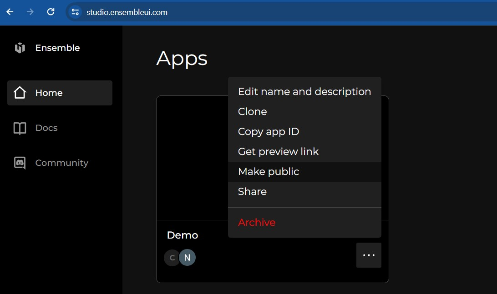

# Composite Widgets

Composite widgets are a powerful concept in Ensemble where multiple smaller widgets are combined to create a more complex and reusable widget.

Composite widgets can be composed of any combination of basic UI elements such as buttons, text fields, labels, etc., allowing app developers to create complex UI components without having to recreate the same layout and functionality multiple times.

#### Benefits of Composite Widgets

1. **Reusability**: Composite widgets can be reused across different parts of an app or even across multiple apps, reducing duplication of code and effort.
2. **Modularity**: By breaking down UI components into smaller widgets, developers can build more modular and maintainable app definitions.
3. **Customization**: Composite widgets allow for easy customization through inputs, enabling app developers to adapt the widget's behavior and appearance to suit different use cases.

## How to use them

When using a composite widget, 

1. prefix the widget name with `ensemble`
2. pass required inputs
3. further customize the widget with optional parameters

```yaml
View:
  body:
    Column:
      children:
        - ensemble.RatingStars:
            inputs: 
              rating: 3
              size: 24
              starColor: white
              starBackgroundColor: red
              starGaps: 8
              starPadding: 8
              starBorderRadius: 40
```

## Directory of composite widgets

| Name | Kitchen sink example | Output |
| ---- | -------------------- | ------ |
| HorizontalProgressBar | [link](https://studio.ensembleui.com/app/e24402cb-75e2-404c-866c-29e6c3dd7992/screen/rlWyrWZrkb6JhxoACptf) |  |
| ImageThumbnailCarousel | [link](https://studio.ensembleui.com/app/e24402cb-75e2-404c-866c-29e6c3dd7992/screen/gRexsL9GfS9k6rLswMck) |  |
| ProfileImageWithIndicator | [link](https://studio.ensembleui.com/app/e24402cb-75e2-404c-866c-29e6c3dd7992/screen/xCU7BvaYzK20NsEuqyNB) |  |
| RatingStars | [link](https://studio.ensembleui.com/app/8PghcmhtGkWiWffmhDDl/widget/pn4g23nRuQ5D8AsN1qtp) |  |


## Contributing to Composite Widgets

Contributions from the community can greatly enhance the functionality and versatility of composite widgets. Here's how you can contribute:

**1. Create your widget**

Create an app and follow these guidelines to create your proposed composite widget.

- In Studio, navigate to widgets tab of your app and create a new widget.
- Your widget should take inputs allowing app developers to customize the widget. Required inputs should be kept to items that without them, the widget cannot be rendered. Styling of the widget should be configurable by using optional inputs. For instance, background of a Column can be made optional.

  ```yaml
    Widget:
      inputs:
        - bgColor # this is optional and defaults to white
      body:
        Column:
          styles:
            backgroundColor: '${ bgColor ? bgColor : "white" }'
  ```

- Avoid setting width and height specially on container widgets such as rows and columns.
- Your widget should be self contained and not rely on definitions outside the widget such as API definitions and storage.


**2. Create a screen documenting the widget**

Within the same app, create a screen to outline inputs and several example usages. See [this example](https://studio.ensembleui.com/app/e24402cb-75e2-404c-866c-29e6c3dd7992/screen/rlWyrWZrkb6JhxoACptf) for reference.

**3. Share your widget on Builder Support**

Join Ensemble [Discord server](https://dsc.gg/ensembleui), and post a new topic in [Builder Support channel](https://discord.com/channels/1031982848485359626/1088664937288699992) with a link to your app.

Make sure to make your app public so that reviewers can access it.




