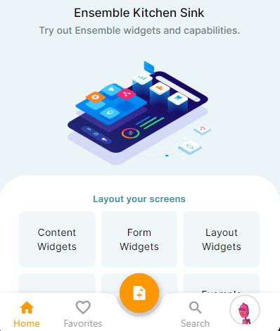

# Animations in EnsembleUI

Welcome to our Animations page! Here, you'll learn how to bring your website to life with stunning page transition animations. Elevate user experience and captivate your audience with smooth transitions that seamlessly guide them through your content. Get ready to add a touch of magic to your web pages with our animation techniques.

Note: `Currently we only support page transition animations`.

**Example**
Let us take an example of how page transition animations work. We can make it work in teo ways either at the [Screen](#page-level-code) or in the [Theme](#theme).

#### Page Level

<div class="code-container" markdown=1>
  <button onclick="copyCode()" class="copy-code-button">Copy Code</button>

```yaml
- Button:
    label: Navigate to Home
    onTap:
      navigateScreen:
        name: Home
        transition:
          type: bottomToTopPop
          duration: 250 # millisecond is default
```

</div>

**Output**

.gif>)

**Explanation**

The `type` property under `transition` property for _NavigateScreen_ action allows you to chose kind of animation you want. There are [list](#list-of-animation-types) of options you can chose from.

#### Theme

We can also define animations in our App theme, here is how you can do it. You can learn more about theme [here]().

<div class="code-container" markdown=1>
  <button onclick="copyCode()" class="copy-code-button">Copy Code</button>

```yaml
Transitions:
  page:
    type: size
    alignment: topRight
    duration: 300 # Millisecond
```

</div>

**Output**



**Explanation**

Works similarly to page level transition in the screen but now we are defining it in [Theme]() which makes it applicable to page transitions across the whole App.

#### List of Animation Types

| Type                | Description                                                                                                                                   |
| :------------------ | :-------------------------------------------------------------------------------------------------------------------------------------------- |
| Fade                | Smoothly transition between pages with a gentle fading effect, creating a seamless and elegant user experience.                               |
| RightToLeft         | Slide pages from right to left, providing a visually pleasing flow that guides users through your content.                                    |
| LeftToRight         | Engage users with a left-to-right animation, giving a sense of progression and intuitive navigation.                                          |
| TopToBottom         | Bring a sense of depth to your pages as they transition from top to bottom, creating a visually immersive experience.                         |
| BottomToTop         | Enhance user engagement by animating pages from bottom to top, adding a touch of dynamism to your website.                                    |
| Scale               | Add a dramatic effect as pages smoothly scale in and out, providing a visually striking transition between content.                           |
| Rotate              | Give your pages a unique twist as they rotate into view, creating a captivating and memorable animation.                                      |
| Size                | Play with the size of your pages as they transition, making them expand or contract for a visually engaging effect.                           |
| RightToLeftWithFade | Combine the sliding motion of right-to-left transition with a fading effect, adding an extra layer of elegance to your page transitions.      |
| LeftToRightWithFade | Blend left-to-right motion with a fade effect, delivering a seamless and visually pleasing transition between pages.                          |
| LeftToRightPop      | Grab attention with a pop animation that slides pages from left to right, creating a dynamic and impactful transition.                        |
| RightToLeftPop      | Add an eye-catching pop animation to your page transitions as they slide from right to left, making a lasting impression on your users.       |
| TopToBottomPop      | Infuse excitement into your transitions with a pop animation that brings pages into view from top to bottom, captivating your audience.       |
| BottomToTopPop      | Elevate user experience with a pop animation that animates pages from bottom to top, adding a delightful touch to your website's transitions. |
