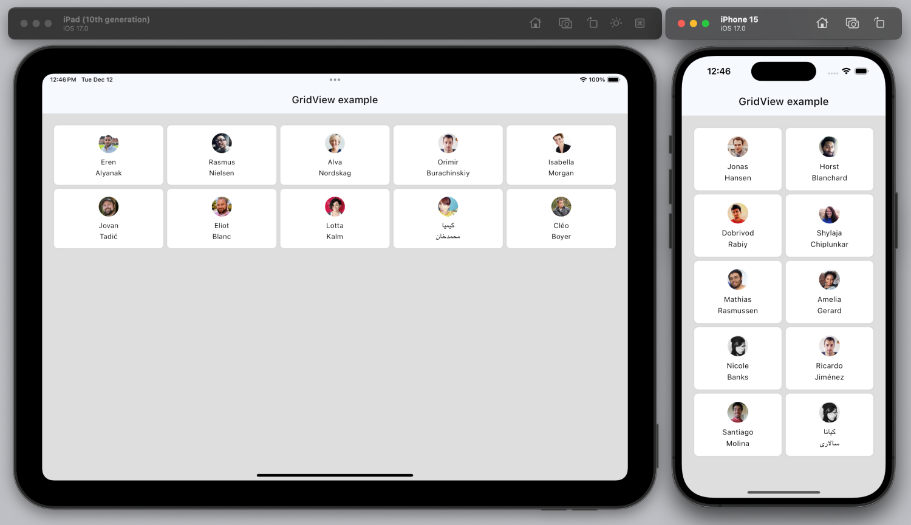
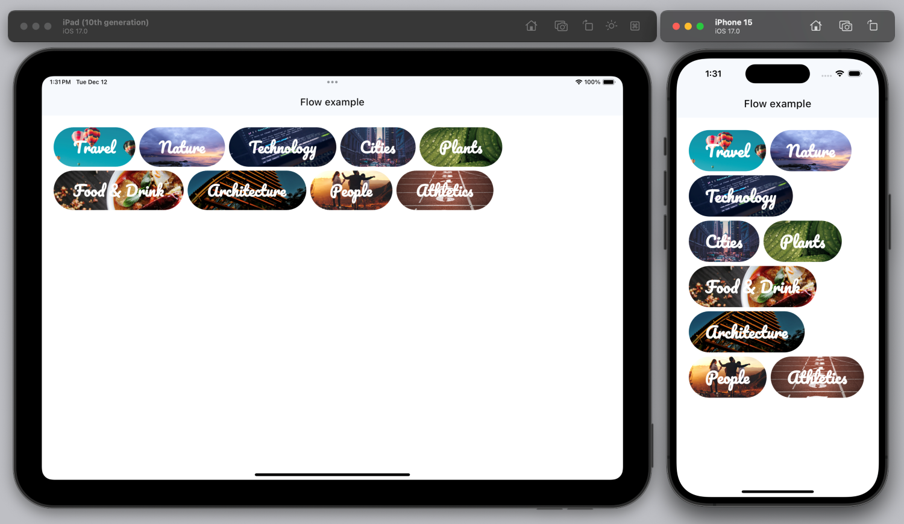
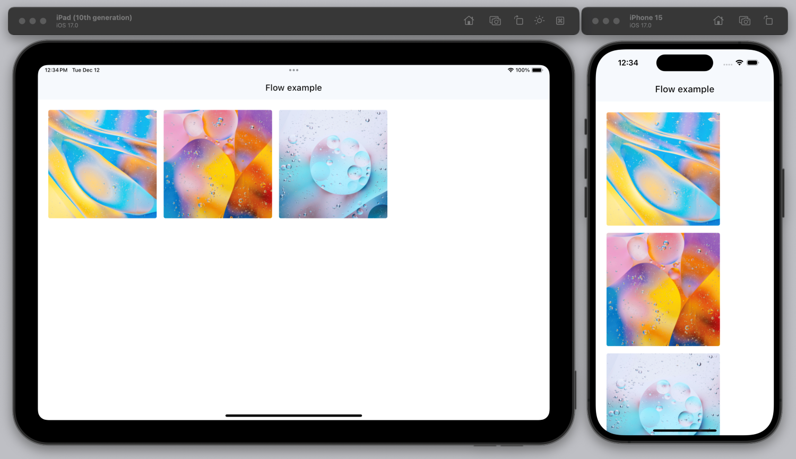

# Building responsive UIs


## In a nutshell:

1. Use `${device.width}` to modify properties according to device width
2. Use the [GridView widget's](/widget-reference/gridview) built-in responsive breakpoints
3. Use the [Flow widget](/widget-reference/flow) to wrap content
4. Use the [Flex widget](/widget-reference/flex) to toggle between horizontal and vertical layouts
5. Avoid setting explicit width and height, specially for container widgets (Rows, Columns, GridView, etc.)


## 1. Modify properties based on device width

You can get the device width and height and modify properties conditionally. In the below example, the column's gap is set to 16 when device width is more than 480, otherwise it is set to 8.

```yaml
Column:
    styles:
        gap: "${ device.width > 480 ? 16 : 8 }"
```


## 2. GridView's built-in breakpoints

[GridView widget](/widget-reference/gridview) includes built-in responsive breakpoints. 

You can pass 1, 3, or 5 values to `horizontalTileCount` property to make the grid responsive based on predefined set of breakpoints.

| Breakpoint | Width |  
| --- | --- |
| xSmall | width <= 480 |
| Small  |  width > 480 && width <= 800 |
| Medium |  width > 800 && width <= 1200 |
| Large  |  width > 1200 && width <= 1600 |
| XLarge |  width > 1600 |

GridView's horizontalTileCount can be:

- 1 number - number of tiles for all breakpoints
- 3 numbers
    * first number corresponds to xSmall and Small,
    * second number corresponds to Medium
    * last numner corresponds to xLarge and Large
- 5 numbers, corresponding to each breakpoint

When not specified, the horizontal tile count is automatic based on resolution.

---

In this example, depending on the available width, there will be 3 to 5 items per row.

```yaml
GridView:
  styles:
    horizontalTileCount: 3 4 5

# Full example here:
# https://studio.ensembleui.com/app/nWsD5baeykm3W772kkSw/screen/WS6fad3K96prUBXM4Hde
```



## 3. Wrap content with Flow widget

[Flow widget](/widget-reference/flow) displays its children horizontally and wraps the children when it runs out of horizontal space.

```yaml
Flow:
  styles:
    gap: 16
    lineGap: 16
  children:
    - MyItem

# Full example here:
# https://studio.ensembleui.com/app/nWsD5baeykm3W772kkSw/screen/YbsqXNaXL5kpxKavlGKQ    
```



## 4. Toggle between horizontal and vertical layouts with Flex widget

[Flex widget](/widget-reference/flex) dynamically switches between a Row or a Column based on the `direction` property.

```yaml
Flex:
  styles:
    direction: '${device.width > 500 ? "horizontal" : "vertical"}'

# Full example here:
# https://studio.ensembleui.com/app/nWsD5baeykm3W772kkSw/screen/jLdWFkmrfgkhuaON568d

```


