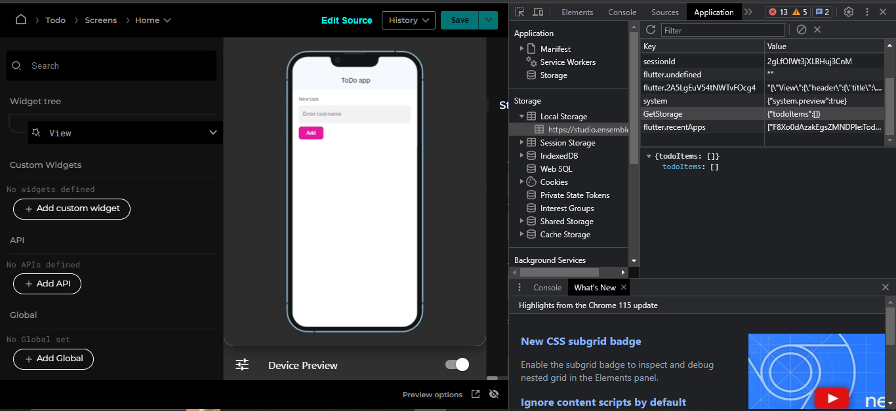
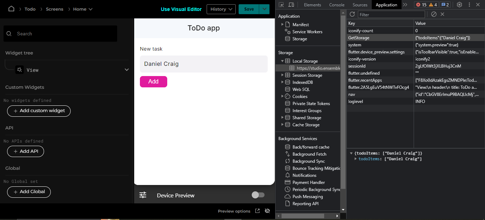

# Store data locally

Ensemble provides local storage that persists unless user clears app or browser data.

In our ToDo example, we will store an array of to-do items in local storage. When the `View` loads, we create this storage item unless it already exists.

```yaml
View:
  header:
    title: ToDo app
  styles:
    scrollableView: true
  onLoad:
    executeCode:
      body: |
        //@code
        if (ensemble.storage.todoItems == null) {
        ensemble.storage.todoItems = [];
        }
```

Once you make the above change, you can verify it in the browser's developer tool. ( If you cannot find it under local storage in dev tools just refresh page while still keeping the dev tools opened and you will find it under GetStorage )



### Store item when form is submitted

Let's add another event handler, this time the form's `onSubmit`.

```yaml
- Form:
    onSubmit: |
      //@code
      var items = ensemble.storage.todoItems;
      items.push(newTodo.value);
      ensemble.storage.todoItems = items;
    children:
      - TextInput:
          id: newTodo
          label: New task
          hintText: Enter task name
          required: true
      - Button:
          label: Add
          submitForm: true
```

Note that we added in `id` property to the `TextInput` so we can reference its value in the code section.

Save and verify the change by adding a new task and pressing the button.


