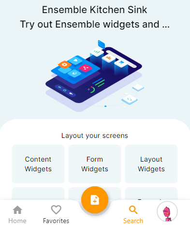
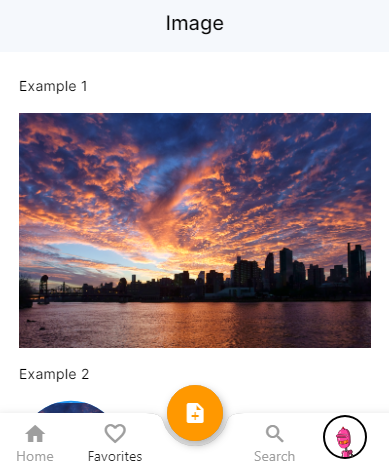

## Profile Picture

Its possible that you might need to have your profile picture as item to navigate to settings page or profile page etc, anyway whichever is your case here is how can do it with EnsembleUI.

**Example**

```yaml
ViewGroup:
    BottomNavBar:
        - customItem:
          widget: CustomNavBarItemWithImage
          selectedWidget: ActiveCustomNavBarItemWithImage
        page: WeeklyScheduler
```

**Output**



**Note:** `Its only specific item code, so as to stay relevant to our topic. You can see complete example` [here](https://studio.ensembleui.com/app/e24402cb-75e2-404c-866c-29e6c3dd7992/screen/aa634599-cd5d-411c-a4b6-1163f3b5c558?propertyPanelEnabled=true&instantPreviewDisabled=false&editorV2Enabled=true)

##### CustomNavBarItemWithImage

<div class="code-container" markdown=1>
  <button onclick="copyCode()" class="copy-code-button">Copy Code</button>

```yaml
CustomNavBarItemWithImage:
  body:
    Column:
      styles:
        padding: 2 8
      children:
        - Image:
            source: https://robohash.org/hicveldicta.png
            styles:
              width: 40
              height: 40
              borderRadius: 40
              borderWidth: 2
              borderColor: 0xFFDEDEDE
```

</div>

##### ActiveCustomNavBarItemWithImage

<div class="code-container" markdown=1>
  <button onclick="copyCode()" class="copy-code-button">Copy Code</button>

```yaml
ActiveCustomNavBarItemWithImage:
  body:
    Column:
      styles:
        padding: 2 8
      children:
        - Image:
            source: https://robohash.org/hicveldicta.png
            styles:
              width: 40
              height: 40
              borderRadius: 40
              borderWidth: 2
              borderColor: black
```

</div>
