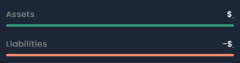

# Making Progress Bars

Progress bars are integral part of UI/UX in Web and mobile applications. It allows representing a quantity in attractive and efficient manner which grabs user attention and much more. Let us look how can we make a progress bar in EnsembleUI.

**Example**
Progress bars can be made in two ways.

#### 1. Using Text Widget

Using [text](/widget-reference/text.md) widget we can make progress bars only that now they are empty and we just style them to achieve our results.

**Code**

<div class="code-container" markdown=1>
  <button onclick="copyCode()" class="copy-code-button">Copy Code</button>

```yaml
Stack:
  children:
    - Text:
        styles:
        backgroundColor: gray
        borderRadius: 10
        height: 15
        text: "          " #100
    - Text:
        styles:
        backgroundColor: green
        borderRadius: 10
        height: 15
        text: "          " #10
```

</div>

- Here we can either use empty space in the _text_ property to increase its width or use _width_ property to var its width.
- Height contribute to its size horizontally.

**Note**: `It might be great but sometimes causes issue when we are testing apps on Ensemble emulator ( ensemble go / ensemble preview app ). For that part method 2 is suggested.`

#### 2 Using Row Widget

Using [Row](/widget-reference/row) widget we can make progress bars. They are also lesser magnetic to errors and compatibility issues.

**Code**

<div class="code-container" markdown=1>
  <button onclick="copyCode()" class="copy-code-button">Copy Code</button>

```yaml
Stack:
  children:
    - Row:
        styles:
          backgroundColor: 0x20FFFFFF
          borderRadius: 4
          height: 4
          width: ${device.width}
        children:
          - Spacer:
              styles:
                size: 4
    - Row:
        styles:
          backgroundColor: ${barColor}
          borderRadius: 4
          height: 4
          width: ${Math.floor(barPercentage/100 * device.width)}
        children:
          - Spacer:
              styles:
                size: 4
```

</div>

- Styled these according to our requirements.
- Spacer is used to add space at bottom of the progress bars.

**Output**


