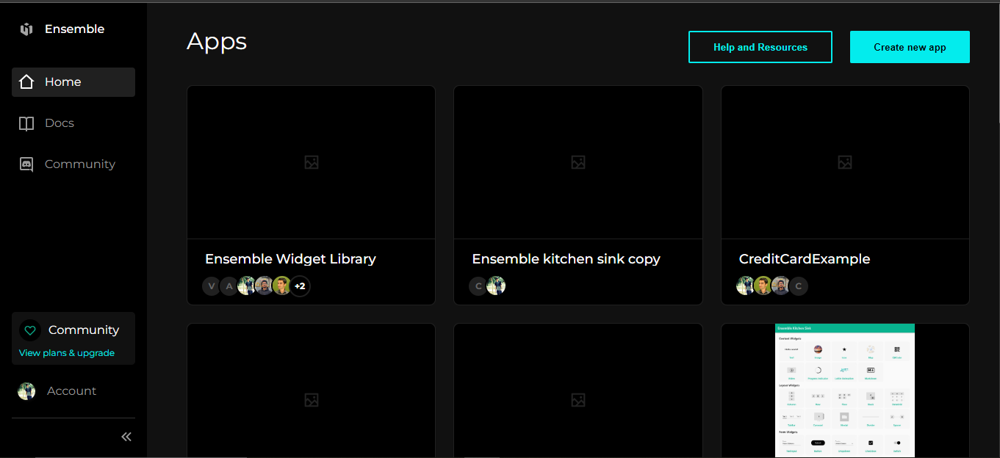
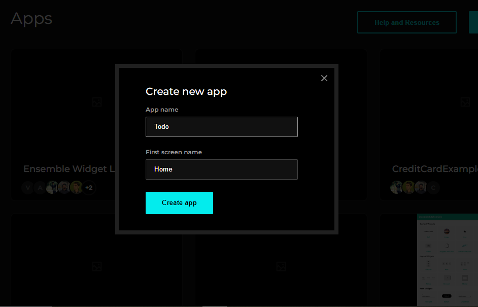
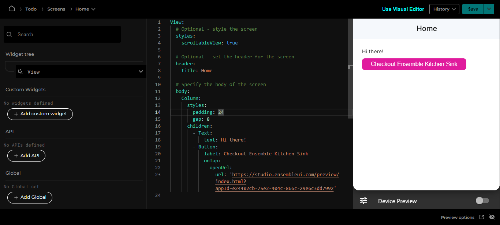

# Create the UI

Get started by creating a new UI in [Ensemble Studio](https://studio.ensembleui.com).

1. Login to Ensemble Studio at [studio.ensembleui.com/sign-in](https://studio.ensembleui.com/sign-in)
2. Click Create new app (creating an app is the same as creating the UI, we call it app for familiarity)

3. Enter a name for your app, also specify a screen name for first screen ( you can create more later on ) and click Create app.

Along with the app, a screen is created. You can add additional screens as you go along to complete your app.

In the editor, you see the definition for the UI of your screen that is rendered on the `right`. While in `center` is a default generated yaml code which is generated whenever a new screen or an App is created. On `left` is `Widget Tree` which shows all the widgets you have used.

