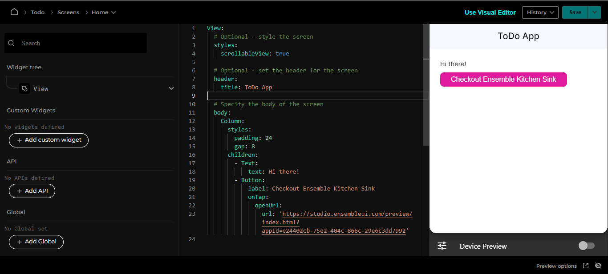

# Make your first edit

Your app definitions are stored server-side. Once you edit and save, the server will notify the client that there are changes to the app. Try it out by changing the title on `Home` screen under `header` from value `Home` to `ToDo App` on line 8. Now click Save at the Top-Right corner or hit `Ctrl + s` on keyboard ( specially if your writing yaml ). You should now see the updated title right away.

