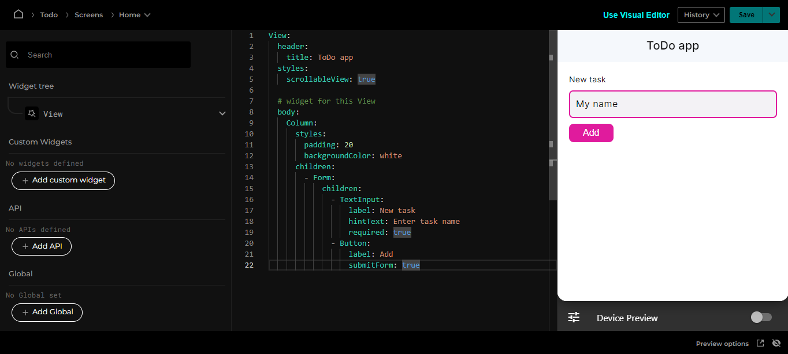

# Add a Form

Let’s create a simple Form starting with this base code you can copy and paste into Ensemble Studio

A Form is a container widget with special behavior such as `onSubmit` event handler.

```yaml
View:
  # Optional - style the screen
  styles:
    scrollableView: true

  # Optional - set the header for the screen
  header:
    title: ToDo App

  # Specify the body of the screen
  body:
    Column:
      styles:
        padding: 24
        gap: 8
      children:
        - Text:
            text: Hi there!
        - Button:
            label: Checkout Ensemble Kitchen Sink
            onTap:
              openUrl:
                url: "https://studio.ensembleui.com/preview/index.html?appId=e24402cb-75e2-404c-866c-29e6c3dd7992"
```

Let's create a simple form with one text input and a button. Start by removing the [Text](/widget-reference/text) and [Button](/widget-reference/button) widget and add a [Form](/widget-reference/form) widget instead.

Take note of proper indentation and make sure everything is nested within another; messing this up could cause misrepresentation of the app's data hierarchy.

### Add a TextInput

Container widgets have a property called `children` where you can add more widgets. Let's add a [TextInput](/widget-reference/textinput) widget. Here's what you should have so far:

```yaml
View:
  header:
    title: ToDo app
  styles:
    scrollableView: true

  # widget for this View
  body:
    Column:
      styles:
        padding: 20
        backgroundColor: white
      children:
        - Form:
            children:
              - TextInput
```

**What is that dash?**

`-` is used in YAML to define array items. Since `children` property takes an array of widgets, we use a `-` each time we add a widget to this property.

### Set properties of the TextInput

We can define the TextInput's behavior by setting a few properties:

```yaml
- TextInput:
    label: New task
    hintText: Enter task name
    required: true
```

### Add a Button

Our form needs a button that triggers the form submission.

```yaml
- Button:
    label: Add
    submitForm: true
```

Save your changes and verify the form appears.

```yaml
View:
  header:
    title: ToDo app
  styles:
    scrollableView: true

  # widget for this View
  body:
    Column:
      styles:
        padding: 20
        backgroundColor: white
      children:
        - Form:
            children:
              - TextInput:
                  label: New task
                  hintText: Enter task name
                  required: true
              - Button:
                  label: Add
                  submitForm: true
```


