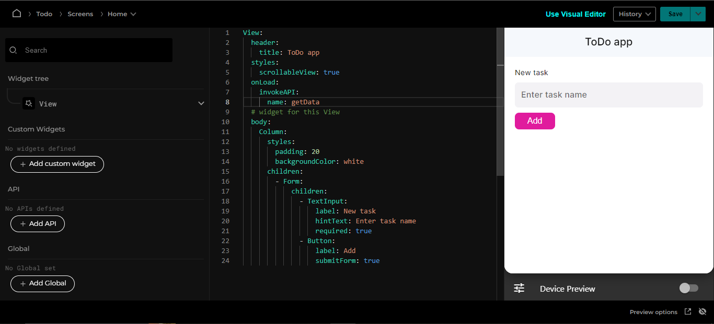

# Handle events

Ensemble widgets can trigger events. For instance, a button has an `onTap` event, and a view has an `onLoad` event.

You handle events by assigning an action to the event:

```yaml
View:
  onLoad:
    action: # perform an action here
```

Let's add a `onLoad` property to the `View`, and then an `action` to this property. You can see available actions in Ensemble [here](/actions/directory).



Note: There is no api to call but the purpose is just to show how actions can be used, you can check all the actions [here](/actions/directory)

Let's use `executeCode` action so we can initiate a local storage variable in the next step.
