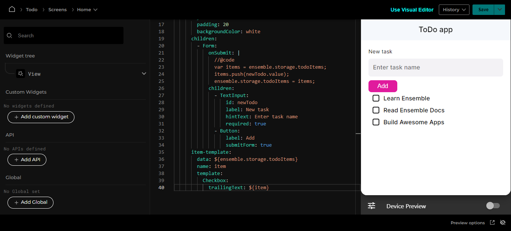

# Display list of items

A common pattern in UI is displaying a list of items. Ensemble provides `item-template` property to achieve this within the YAML syntax. You can assign this property to container widgets such as `Column`, `Row`, etc.

`item-template` takes the following properties:

- `data`: This should point to an array of data.
- `name`: Set this to a value to reference in the `template`.
- `template`: This is where we define the widgets to render for each item.

| Property | Type   | Description                                                                     |
| -------- | ------ | ------------------------------------------------------------------------------- |
| data     | string | Bind to an array of data from an API response or a variable                     |
| name     | string | Set the name to reference as you iterate through the array of data              |
| template | widget | The data row widget to render for each item, it can be a custom widget as well. |

Let's add `item-template` that will display a list of checkboxes for the ToDo items.

```yaml
item-template:
  data: ${ensemble.storage.todoItems}
  name: item
  template:
    Checkbox:
      trailingText: ${item}
```

Notice the use of `${}`. This is how you tell Ensemble that what's inside the bracket is an expression to be evaluated. In other words, if you're point to a data or doing inline logic, you wrap them with `${}`.

complete code until now

```yaml
View:
  header:
    title: ToDo app
  styles:
    scrollableView: true
  onLoad:
    executeCode:
      body: |
        //@code
        if (ensemble.storage.todoItems == null) {
        ensemble.storage.todoItems = [];
        }
  # widget for this View
  body:
    Column:
      styles:
        padding: 20
        backgroundColor: white
      children:
        - Form:
            onSubmit: |
              //@code
              var items = ensemble.storage.todoItems;
              items.push(newTodo.value);
              ensemble.storage.todoItems = items;
            children:
              - TextInput:
                  id: newTodo
                  label: New task
                  hintText: Enter task name
                  required: true
              - Button:
                  label: Add
                  submitForm: true
      item-template:
        data: ${ensemble.storage.todoItems}
        name: item
        template:
          Checkbox:
            trailingText: ${item}
```

Once you save, you should see the item you added previously. Test it by adding a new item too.


