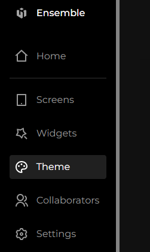
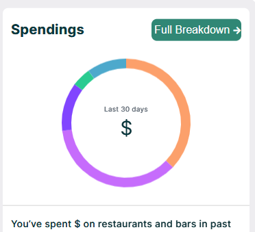

# General Color for All Buttons across an App

Defining a theme for your app so as to save time for writing repeated code for text colors, backgroundColors etc is a better way for being efficient and avoiding DRY principle. EnsembleUI enables us to define our own App theme. You can find more about themes [here](). For now lets focus on achieving a general color our Button text.

**Example**
Lets us consider an App where we want to use `0xFF308775` color for our all Buttons text. To achieve this we will use Theme option in ensemble studio.

**Steps**

1. Go to your App and click on **Theme** in left side panel. Here is hw it looks like.

.

2. Then use the code below to define [primary]() color for button color, focus color etc.

**Code**

<div class="code-container" markdown=1>
  <button onclick="copyCode()" class="copy-code-button">Copy Code</button>

```yaml
# define your app theme here
Colors:
  primary: 0xFF308775
```

</div>

**Output**



Note: `Just like all other Web and Mobile technologies like Html, Css and Flutter etc if there is style done on a button it will be of higher priority then theme so to let theme work no need to style button color at all.`
