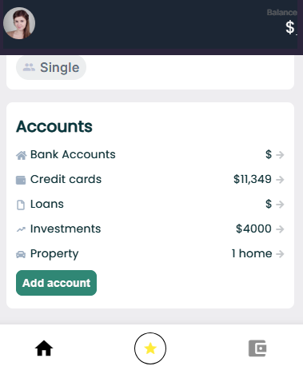
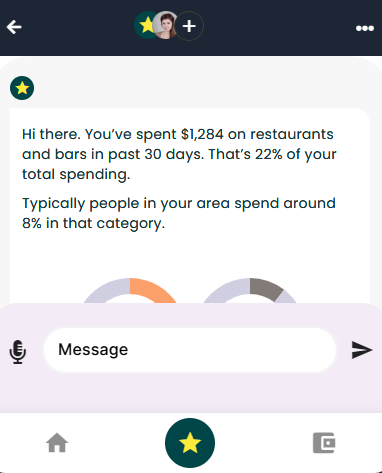

## Icon Without Label

Since these kind of icons require us to utilize [custom widgets]() thus we will be using **customItem** widget for getting through it. It has two properties namely **widget** and **selectedWidget**.

| Property       | Type   | Description                                                            |
| :------------- | :----- | :--------------------------------------------------------------------- |
| widget         | widget | Used for inactive item.                                                |
| selectedWidget | widget | Used for active item.                                                  |
| page           | screen | Used for naming the screen to which we navigate once clicked upon item |

We will utilize these two to achieve two different states for an icon active and inactive. Let us see the code example

**Example**

<div class="code-container" markdown=1>
  <button onclick="copyCode()" class="copy-code-button">Copy Code</button>

```yaml
ViewGroup:
  BottomNavBar:
    styles:
      backgroundColor: white
      color: 0xFF9DAEC1
      selectedColor: black
      floatingBackgroundColor: 0xFF8A1C9D
      floatingIconColor: white
      notchColor: 0xFF0F0E1C
    items:
      - customItem:
          widget:
            IconWidget:
              inputs:
                icon: home
          selectedWidget:
            ActiveIconWidget:
              inputs:
                icon: home
        page: Home

      - customItem:
          widget: IconOnlyWidget
          selectedWidget: ActiveIconOnlyWidget
        page: Chat

      - customItem:
          widget:
            IconWidget:
              inputs:
                icon: account_balance_wallet
          selectedWidget:
            ActiveIconWidget:
              inputs:
                icon: account_balance_wallet
        page: Home
```

</div>

**Output**



**Note:**`BottomNavBar is used to navigate across whole application so it always has a separate screen where it comes under [View Group]() with all the items corresponding to each screen of your application.`

**Explanation**

Each item has two properties for active and inactive widget. [IconWidget](#iconwidget) and [IconOnlyWidget](#icononlywidget) represents the in-active state / screen while [ActiveIconWidget](#activeiconwidget) and [ActiveIconOnlyWidget](#activeicononlywidget) for active state / screen. Both of these are [custom widgets](). Its important to notice that [IconWidget](#iconwidget) and [ActiveIconWidget](#activeiconwidget) accept input as well which is the **name** of the **icon** we want to use.

##### IconWidget

<div class="code-container" markdown=1>
  <button onclick="copyCode()" class="copy-code-button">Copy Code</button>

```yaml
IconWidget:
  inputs:
    - icon
  body:
    Column:
      styles: { mainAxis: center, crossAxis: center }
      children:
        - Icon:
            icon: ${icon}
            styles:
              color: 0x70000000
              size: 28
```

</div>

##### ActiveIconWidget

<div class="code-container" markdown=1>
  <button onclick="copyCode()" class="copy-code-button">Copy Code</button>

```yaml
ActiveIconWidget:
  inputs:
    - icon
  body:
    Column:
      styles: { mainAxis: center, crossAxis: center }
      children:
        - Icon:
            icon: ${icon}
            styles:
              color: black
              size: 28
```

</div>

##### IconOnlyWidget

<div class="code-container" markdown=1>
  <button onclick="copyCode()" class="copy-code-button">Copy Code</button>

```yaml
IconOnlyWidget:
  body:
    Column:
      styles: { mainAxis: center, crossAxis: center }
      children:
        - Icon:
            icon: star
            styles:
              backgroundColor: transparent
              borderColor: black
              color: yellow
              borderRadius: 26
              padding: 10
              size: 18
```

</div>

##### ActiveIconOnlyWidget

<div class="code-container" markdown=1>
  <button onclick="copyCode()" class="copy-code-button">Copy Code</button>

```yaml
ActiveIconOnlyWidget:
  body:
    Column:
      styles: { mainAxis: center, crossAxis: center }
      children:
        - Icon:
            icon: star
            styles:
              backgroundColor: 0xFF004548
              color: yellow
              borderRadius: 26
              padding: 12
              size: 26
```

</div>
