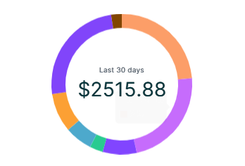

# Inputs to ChartJs

The ChartJs widget in ensemble may sometime not accept variables in plain ChartJS widget so a better way to go about this is to use Code section in ensemble to define configuration for the ChartJs and there we can easily use the variables ( inputs ). In our example we will look how we use labels passed as inputs to the ChartJs custom widget and use them according to our need.

**Example**

#### Custom Widget

<div class="code-container" markdown=1>
  <button onclick="copyCode()" class="copy-code-button">Copy Code</button>

```yaml
Widget:
  inputs:
    - spending
    - categories

  onLoad: |

    //@code
    chart.config = {
      type: 'doughnut',
      data: {
        labels: categories,
        datasets: [{
          data: [608, 590, 200, 79, 163,231,637,63],
          backgroundColor: ['#FCA06B','#C66CFC','#8145FF', '#29CB90', '#4DA9CC','#FCA034',"#8145FA","#814500"],
          hoverOffset: 2,
          borderWidth: 0
        }]
      },
      options: {
        aspectRatio: 1,
        cutout: 80 ,
        plugins: {
          legend: {
            display: false
          },
          tooltip: {
            enabled: true,
            position: "nearest"
          }
        },
        layout: {
          padding: 0
        }
      }
    };

  body:
    Column:
      styles:
        gap: 12
      children:
        - Row:
            styles: { crossAxis: center, mainAxis: center, padding: 20 0 }
            children:
              - Stack:
                  styles: { alignChildren: center }
                  children:
                    - ChartJs:
                        id: chart
                        styles: { width: 200, height: 200 }

                    - Column:
                        styles: { crossAxis: center, gap: 0, mainAxis: center }
                        children:
                          - Text:
                              text: Last 30 days
                              styles:
                                textStyle:
                                  color: 0xFF667483
                                  fontSize: 10
                          - Text:
                              text: "$${spending}"
                              styles:
                                textStyle:
                                  color: 0xFF063940
                                  fontSize: 28
                                textAlign: end
```

#### Screen Code

<div class="code-container" markdown=1>
  <button onclick="copyCode()" class="copy-code-button">Copy Code</button>

```yaml
Spendings:
  inputs:
  spending: ${ensemble.storage.spendingLastDays.toFixed(2)}
  categories: ${ensemble.storage.categories}
```

</div>

**Output**



</div>

#### Explanation

The _categories_ and _spending_ are our inputs passed to this Custom Widget from one of our screens. Categories is an array consisting of string values. This input array is used as a value for **labels** property in the CharJs configuration if you paid close attention to the code for [Custom Widget](#custom-widget). This is how we can pass inputs to ChartJs and make it dynamic.
