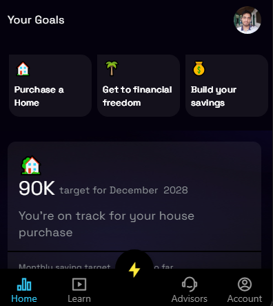
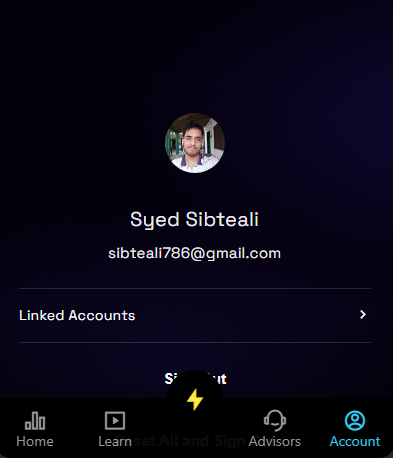

# Using navigate Screen with BottomNavBar

We can use [navigateScreen](/build/make-it-interactive/actions-and-events/8-navigateScreen) for combining functionality of [BottomNavBar](/build/user-interface/1-page-structure) together with it for daily tasks like beside using BottomNavBar items to navigate across different screens, we can also make use of [navigateScreen](/build/make-it-interactive/actions-and-events/8-navigateScreen) here to navigate across screen keeping the bottomNavBAr in place as well. Let us look at an example to make better sense of it.

**Example**

In this scenario we want to navigate to Profile screen using `Account` item in the bottomNavBar menu and also an icon in our `dashboard` screen. Given is code for different screen widgets `CustomHeader` for our screen header with an Profile Picture and [ViewGroup](/build/user-interface/1-page-structure) with bottomNavBar.

**Explanation**

- For each item in the menu we have used an expression which evaluates `selectedIndex` every time our screen re-renders ( it renders whenever user navigates from one screen to other screen using menu items ).
- Account item have `selectedIndex` of 4 as we are sending it as input from `navigateScreen` action in the `dashboard` screen's `CustomHeader` widget.
- So when we click on Profile Picture in the header for dashboard screen the bottomNavbar re-renders updating selectedIndex value which evaluates true for only `Account` item and thus we move to profile screen using both `Account` Item and the `Profile Picture`

**Code**

```yaml
CustomHeader:
  body:
    Row:
      styles:
        mainAxis: spaceBetween
        crossAxis: center
        backgroundColor: 0xff04010d
      children:
        - Markdown:
            styles:
              textStyle:
                fontSize: 16
                color: white
            text: Your Goals
        - Image:
            styles:
              width: 40
              height: 40
              borderRadius: 40
              placeholderColor: transparent
            source: ${auth.user.photo}
            onTap:
              navigateScreen:
                name: App
                inputs:
                  selectedIndex: 4
```

ViewGroup with BottomNavBar

```yaml
ViewGroup:
  BottomNavBar:
    styles:
      backgroundColor: 0xEE000000
      floatingBackgroundColor: black
      floatingIconColor: yellow
      notchColor: black
      selectedColor: 0xFF34CAF7
      color: 0xFF999999

    items:
      - label: Home
        icon:
          name: bar_chart_2_line
          library: remix
        page: Home

      - label: Learn
        icon:
          name: movie_line
          library: remix
        page: Insights

      - label: Advisors
        icon:
          name: customer_service_2_line
          library: remix
        page: Advisors

      - label: Account
        icon:
          name: account_circle_line
          library: remix
        page: Account
        selected: "${selectedIndex == 4 ? true : false}"

      - icon:
          name: flashlight_fill
          library: remix
        floating: true
        floatingAlignment: center
        floatingMargin: 0
        onTap:
          navigateScreen:
            name: ChatPage
            inputs:
              threadId: 0
              userId: "${ensemble.storage.userAccount != null ? ensemble.storage.userAccount.id : ''}"
```




