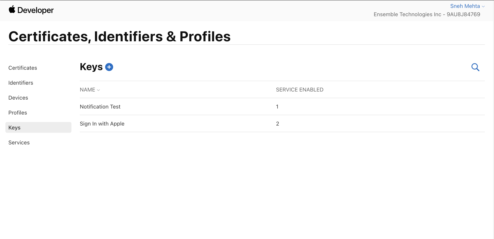
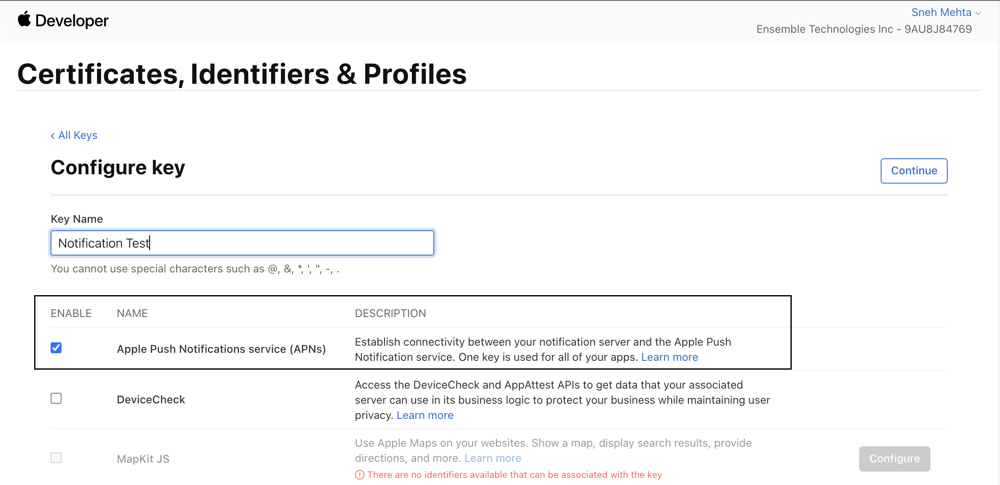
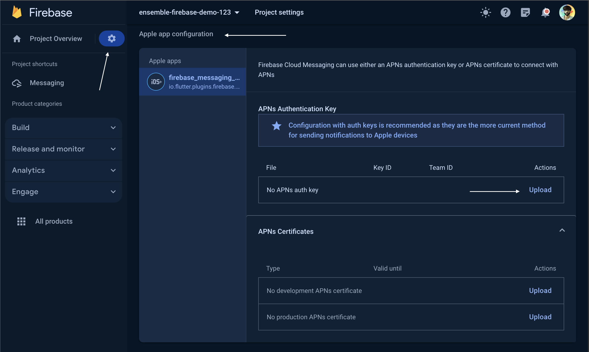

# Push Notification

So, you have built the app with ensemble but now you would like to increase the engagement and decided to implement push notification. 

At ensemble we are currently supporting push notification with firebase. Here are the following steps need to be taken to enable push notification.

- Initialize Notification manager
- IOS setup, (Android doesn't require any setup).

## Setup Notification manager

In `main.dart` inside `main()` initialize notification manager with your firebase payload and `backgroundNotificationHandler`.
- The firebase payload data can be found in Project Settings > Your apps.
- `backgroundNotificationHandler`'s purpose is to allow you write any business logic. Here in example we are updating the app icon badge but it can be set to any business logic.

```dart
void main() async {
  WidgetsFlutterBinding.ensureInitialized();
  await NotificationManager().init(
      FirebasePayload(
        apiKey: '<your-api-key>',
        projectId: '<your-project-id>',
        messagingSenderId: '<your-messaging-sender-id>',
        appId: '<your-app-id>',
      ),
      backgroundNotificationHandler:_backgroundNotificationHandler,
);

@pragma('vm:entry-point')
Future<void> _backgroundNotificationHandler(RemoteMessage message) async {
  try {
    //  business logic
    await StorageManager().init();
    int badgeCount =
        Utils.getInt(await StorageManager().read('badgeCount'), fallback: 0);
    int count = badgeCount + 1;
    await StorageManager().write('badgeCount', count);
    if (await FlutterAppBadger.isAppBadgeSupported()) {
      return FlutterAppBadger.updateBadgeCount(count);
    }

  } catch (error) {
    debugPrint("Error running background handler ${error.toString()}");
  }
}

```

## IOS setup

####  Add push notification capability in xcode


#### Create an APNs key 
Here is the link to apple developer website to create APNs key and download it.[Apple developer key link](https://developer.apple.com/account/resources/authkeys/list)




#### Upload APNs key to Firebase 

Now upload the APNs key to firebase console. 
So, under the firebase project settings > Cloud Messaging > Apple app configuration. You can upload the APNs key that we downloaded from the previous step.



---
That's all now you can go to your firebase messaging module and send a push notification and it will work for both the platform android and IOS. 