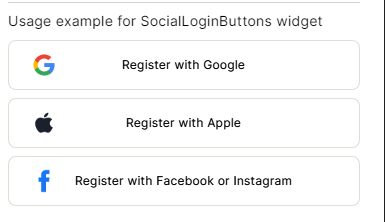

# Conditional

Conditional widget allows developers to conditionally render UI elements based on specified conditions, enhancing dynamic content display and personalized user experiences within the app.

### Properties

| Property   | Type  | Description                                                                                  |
| ---------- | ----- | -------------------------------------------------------------------------------------------- |
| conditions | array | Allow users to conditionally render their widgets using `if`, `elseif` and `else` statements |

**Example**
Conditional widget is very useful specially when making a custom widget where users might want to have a default value and an optional value. Let us take an example for its use case

Consider that you are trying to make a custom widget or Button for dealing with social logins, since there are more than on platforms like Meta, Google, Apple etc so choosing an image based on `provider` variable is a viable choice. But how can we check if `provider` is apple or google etc ?

#### Steps

- First of all declare the base custom widget yaml code. Then use `Conditional` to render `Image` widget accordingly.

**Code**

```yaml
Widget:
  inputs:
    - provider
    - label
  onLoad: |
    //@code

    console.log(provider);
    console.log(label);

    function capitalizeString(str) {
      return str.charAt(0).toUpperCase() + str.substring(1) ;
    }

    if (label.length > 0 )
      providerText.text = label;
    else
      providerText.text = "Sign In With " + capitalizeString(provider);

  body:
    Stack:
      styles:
        alignChildren: centerLeft
      children:
        - Conditional:
            conditions:
              - if: ${provider === 'apple' || provider === 'Apple' }
                Image:
                  source: https://firebasestorage.googleapis.com/v0/b/ensemble-web-studio.appspot.com/o/custom_widgets_assets%2Fsocial_login%2Fapple.png?alt=media&token=893491f0-5300-4b29-8fce-30fe98eaec76
                  styles:
                    height: 24
                    width: 24
                    padding: 0 24
              - elseif: ${provider === 'google' || provider === 'Google' }
                Image:
                  source: https://firebasestorage.googleapis.com/v0/b/ensemble-web-studio.appspot.com/o/custom_widgets_assets%2Fsocial_login%2Fgoogle.png?alt=media&token=c91b1a27-a0bd-40c2-b82d-0f250762bc0b
                  styles:
                    height: 24
                    width: 24
                    padding: 0 24

        - Row:
            id: rowId
            styles:
              borderColor: 0xFFDEDED4
              crossAxis: center
              mainAxis: center
              borderRadius: 8
              height: 50
            children:
              - Text:
                  id: providerText
                  styles:
                    textStyle:
                      fontSize: 12
```

**Output**

This is how it looks as you complete it.


