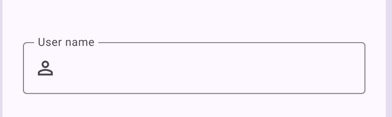

# TextInput widget

The TextInput Widget enables the rendering of interactive text input fields, allowing users to enter and edit text within your application for data input and interaction.

[Test in Kitchen Sink](https://studio.ensembleui.com/app/e24402cb-75e2-404c-866c-29e6c3dd7992/screen/abc081b1-bcb4-4db6-ae55-7987cb6c418e)

## Properties

| Property                | Type                                           | Description                                                                                                                                                                                                                       |
|:------------------------|:-----------------------------------------------|:----------------------------------------------------------------------------------------------------------------------------------------------------------------------------------------------------------------------------------|
| id                      | string                                         | ID to be referenced later                                                                                                                                                                                                         |
| maxWidth                | integer                                        | The max width of this Input widget (default 700). while min vlaue can be `0` and maximum can be `5000`                                                                                                                            |
| label                   | string                                         | Label for your widget                                                                                                                                                                                                             |
| labelHint               | string                                         | Hint text on your label                                                                                                                                                                                                           |
| labelStyle              | [TextStyle](/widget-reference/types#TextStyle) | Styling for the label                                                                                                                                                                                                             |
| hintText                | string                                         | Hint text explaining your widget                                                                                                                                                                                                  |
| hintStyle               | object                                         | Styling the hint text. Default to theme's bodyMedium styling. [see properties](#hintstyles)                                                                                                                                       |
| required                | boolean                                        | Whether the field is required                                                                                                                                                                                                     |
| enabled                 | boolean                                        | Enables or disables the interactivity and input functionality of the widget                                                                                                                                                       |
| icon                    | object                                         | [See properties](#icon)                                                                                                                                                                                                           |
| styles                  | object                                         | [See properties](#styles)                                                                                                                                                                                                         |
| validator               | object                                         | [See properties](#validator) [Example](https://studio.ensembleui.com/app/a2qNNXgcmhBxfrTMBVGB/screen/AzD8jmw9Xk2zrGa1IVqd)   |
| validateOnUserInteraction | boolean | Default: false. When set to true, validates the user's input on every keypress. [Example](https://studio.ensembleui.com/app/a2qNNXgcmhBxfrTMBVGB/screen/AzD8jmw9Xk2zrGa1IVqd)
| value                   | string                                         | Specifying the value of your Text Input                                                                                                                                                                                           |
| inputType               | string                                         | Pick a predefined input type ` default` `email` `phone ` `number` `text` `url` `datetime ` `ipAddress`                                                                                                                            |
| keyboardAction          | string                                         | Specify the action key on native device's soft keyboard                                                                                                                                                                           |
| obscureText             | boolean                                        | whether we should obscure the typed-in text (e.g Social Security)                                                                                                                                                                 |
| obscureToggle           | boolean                                        | enable the toggling between plain and obscure text.        |                
| readOnly                | boolean                                        | When it is true, the text cannot be modified by any shortcut or keyboard operation.                 |
| selectable              | boolean                                        | Setting this to true will enable features such as long-pressing the TextField to select text and show the cut/copy/paste menu, and tapping to move the text caret text.                                                                                                                                                                                |
| toolbarDone             | boolean                                        | Display the toolbar with done button on top of the keyboard. (defaults to False)                                                                                                                                                  |
| textStyle               | object                                         | An opaque object that determines the size, color, and decoration of text. Similar properties as hintStyle [see properties](#hintstyles)                                                                                           |
| mask                    | string                                         | It formats the input by a given mask. Ex: +# (###) ###-##-##. detailed examples can be seen in [Kitchen Sink](https://studio.ensembleui.com/app/e24402cb-75e2-404c-866c-29e6c3dd7992/screen/abc081b1-bcb4-4db6-ae55-7987cb6c418e) |
| delayedKeyPressDuration | integer                                        | The delay in milliseconds to trigger onDelayedKeyPress ( min : 0)                                                                                                                                                                 |
| multiline               | boolean                                        | Specifies if this TextInput can span multiple lines. (default False)                                                                                                                                                              |
| minLines                | integer                                        | Specifies the minimum number of lines to start out (applicable for multiline)                                                                                                                                                     |
| maxLines                | integer                                        | Specifies the maximum number of lines to visually expand to. This will also enable multi-line if this number is greater than 1 and the 'multiline' property is not set.                                                           |
| floatLabel | boolean | [floating label example](#floating-label-example)

### Actions

| Name              | description                                                                                                                                                                                                          |
| :---------------- | :------------------------------------------------------------------------------------------------------------------------------------------------------------------------------------------------------------------- |
| onKeyPress        | On every keystroke, call Ensemble's built-in functions or execute code                                                                                                                                               |
| onFocusReceived   | Execute an Ensemble action when the field receives focus                                                                                                                                                             |
| onFocusLost       | Execute an Ensemble action when the field loses focus                                                                                                                                                                |
| onChange          | Call Ensemble's built-in functions or execute code when the input changes. Note for free-form text input, this event only dispatches if the text changes AND the focus is lost (e.g. clicking on button)             |
| onDelayedKeyPress | Execute an Action after a brief delay specified by delayedKeyPressDuration (default: 300 ms). Consecutive calls within this delay will reset the timer, useful for minimizing server calls for type-ahead scenarios. |

### icon

| Property | Type              | Description                                                                                                                                                                                                                                                                                                                         |
| :------- | :---------------- | :---------------------------------------------------------------------------------------------------------------------------------------------------------------------------------------------------------------------------------------------------------------------------------------------------------------------------------- |
| name     | string            | The name of the icon                                                                                                                                                                                                                                                                                                                |
| library  | string            | Which icon library to use.                                                                                                                                                                                                                                                                                                          |
| color    | integer or string | The color specification for the text, which can be represented in different formats. It can be specified as a number, a predefined color name, or a hexadecimal value starting with '0x'. `transparent` `black` `blue` `white` `red` `grey` `teal` `amber` `pink` `purple` `yellow` `green` `brown` `cyan` `indigo` `lime` `orange` |
| size     | integer           | Defines the dimensions or magnitude of an element, allowing control over its overall size within the layout.                                                                                                                                                                                                                        |

### styles

| Property                     | Type              | Description                                                                                                                                                                                                                                                                                                                                   |
| :--------------------------- | :---------------- | :-------------------------------------------------------------------------------------------------------------------------------------------------------------------------------------------------------------------------------------------------------------------------------------------------------------------------------------------- |
| fontSize                     | integer           | Sets the size of the text.                                                                                                                                                                                                                                                                                                                    |
| borderRadius                 | string or integer | The border radius of the widget.This can be specified using CSS-like notation with 1 to 4 integers. Minimum value: 0.                                                                                                                                                                                                                         |
| borderColor                  | integer or string | Sets the border color, starting with '0xFF' for full opacity. `transparent` `black` `blue` `white` `red` `grey` `teal` `amber` `pink` `purple` `yellow` `green` `brown` `cyan` `indigo` `lime` `orange`                                                                                                                                       |
| borderWidth                  | integer           | Thickness of the border. Minimum value should be 0.                                                                                                                                                                                                                                                                                           |
| fontSize                     | integer           | Sets the size of the text.                                                                                                                                                                                                                                                                                                                    |
| stackPositionTop             | integer           | The distance of the child's top edge from the top of the stack. This is applicable only for Stack's children.                                                                                                                                                                                                                                 |
| stackPositionBottom          | integer           | The distance that the child's bottom edge from the bottom of the stack. This is applicable only for Stack's children.                                                                                                                                                                                                                         |
| stackPositionLeft            | integer           | The distance that the child's left edge from the left of the stack. This is applicable only for Stack's children.                                                                                                                                                                                                                             |
| stackPositionRight           | integer           | The distance that the child's right edge from the right of the stack. This is applicable only for Stack's children.                                                                                                                                                                                                                           |
| errorBorderColor             | integer or string | The border color when there are errors on this input field. This property can be defined in the theme to apply to all Input widgets, starting with '0xFF' for full opacity. `transparent` `black` `blue` `white` `red` `grey` `teal` `amber` `pink` `purple` `yellow` `green` `brown` `cyan` `indigo` `lime` `orange`                         |
| focusedBorderColor           | integer or string | The border color when this input field is receiving focus. This property can be defined in the theme to apply to all Input widgets, starting with '0xFF' for full opacity. `transparent` `black` `blue` `white` `red` `grey` `teal` `amber` `pink` `purple` `yellow` `green` `brown` `cyan` `indigo` `lime` `orange`                          |
| focusedErrorBorderColor      | integer or string | The border color of this input field when it is receiving focus in its error state. This property can be defined in the theme to apply to all Input widgets, starting with '0xFF' for full opacity. `transparent` `black` `blue` `white` `red` `grey` `teal` `amber` `pink` `purple` `yellow` `green` `brown` `cyan` `indigo` `lime` `orange` |
| disabledBorderColor          | integer or string | The border color when this input field is disabled. This property can be defined in the theme to apply to all Input widgets, starting with '0xFF' for full opacity. `transparent` `black` `blue` `white` `red` `grey` `teal` `amber` `pink` `purple` `yellow` `green` `brown` `cyan` `indigo` `lime` `orange`                                 |
| fillColor                    | integer or string | The fill color for this input fields. This property can be defined in the theme to apply to all Input widgets, starting with '0xFF' for full opacity. `transparent` `black` `blue` `white` `red` `grey` `teal` `amber` `pink` `purple` `yellow` `green` `brown` `cyan` `indigo` `lime` `orange`                                               |
| contentPadding               | integer or string | Padding around your input content with CSS-style notation e.g. margin: 5 20 5                                                                                                                                                                                                                                                                 |
| variant                      | string            | Select a pre-defined look and feel for this Input widget. This property can be defined in the theme to apply to all Input widgets. [see properties](#options-for-stylesvariant)                                                                                                                                                               |
| alignment                    | string            | The alignment of the widget relative to its parent. `topLeft`, `topCenter`, `topRight`, `centerLeft`, `center`, `centerRight`, `bottomLeft`, `bottomCenter`, `bottomRight`                                                                                                                                                                    |
| visible                      | boolean           | Toggle a widget visibility on/off. Note that an invisible widget will not occupy UI space, unless the visibilityTransitionDuration is specified.                                                                                                                                                                                              |
| visibilityTransitionDuration | number            | Specify the duration in seconds when a widget animates between visible and not visible state. Note that setting this value will cause the widget to still occupy the UI space even when it is not visible.                                                                                                                                    |
| captureWebPointer            | boolean           | Applicable for Web only. When overlaying widgets on top of certain HTML container (e.g. Maps), the mouse click is captured by the HTML container, causing issue interacting with the widget. Use this to capture and maintain the mouse pointer on your widget.                                                                               |
| expanded                     | boolean           | If the parent is a Row or Column, this flag will stretch this widget in the appropriate direction. (e.g stretch horizontally for parent of type Row)                                                                                                                                                                                          |
| elevation                    | integer           | The z-coordinate at which to place this material relative to its parent. A non-zero value will show a shadow, with its size relative to the elevation value. Minimum value: 0, Maximum value: 24                                                                                                                                              |
| elevationShadowColor         | integer or string | The shadow color for the elevation, which can be represented in different formats. It can be specified as a number, a predefined color name, or a hexadecimal value starting with '0x'. `transparent` `black` `blue` `white` `red` `grey` `teal` `amber` `pink` `purple` `yellow` `green` `brown` `cyan` `indigo` `lime` `orange`             |
| elevationBorderRadius        | string or integer | The border radius of the widget.This can be specified using CSS-like notation with 1 to 4 integers. Minimum value: 0.                                                                                                                                                                                                                         |

### hintStyles

| Property           | Type              | Description                                                                                                                                                                                                                                                                                                                                             |
| :----------------- | :---------------- | :------------------------------------------------------------------------------------------------------------------------------------------------------------------------------------------------------------------------------------------------------------------------------------------------------------------------------------------------------ |
| fontSize           | integer           | Sets the size of the text.                                                                                                                                                                                                                                                                                                                              |
| fontWeight         | string            | The thickness of the glyphs used to draw the text. `light` `normal` `bold` `w100` `w200` `w300` `w400` `w500` `w600` `w700` ` w800``w900 `                                                                                                                                                                                                              |
| color              | integer or string | The color specification for the text, icons, divider etc, which can be represented in different formats. It can be specified as a number, a predefined color name, or a hexadecimal value starting with '0x'. `transparent` `black` `blue` `white` `red` `grey` `teal` `amber` `pink` `purple` `yellow` `green` `brown` `cyan` `indigo` `lime` `orange` |
| overflow           | string            | Set treatment of text longer than available space `wrap` `visible` `clip` `ellipsis`                                                                                                                                                                                                                                                                    |
| backgroundColor    | integer or string | Background color of the box. which can be represented in different formats. It can be specified as a number, a predefined color name, or a hexadecimal value starting with '0x'. `transparent` `black` `blue` `white` `red` `grey` `teal` `amber` `pink` `purple` `yellow` `green` `brown` `cyan` `indigo` `lime` `orange`                              |
| fontfamily         | string            | Allows users to chose a specific font-family other than the default one.                                                                                                                                                                                                                                                                                |
| decoration         | string            | A linear decoration to draw near the text or whether to slant the glyphs in font. `none` `lineThrough` `underline` `overline`                                                                                                                                                                                                                           |
| decorationStyle    | string            | The style in which to paint the text decorations (e.g., dashed). `solid` `double` `dotted` `dashed` `wavy`                                                                                                                                                                                                                                              |
| isItalic           | boolean           | Whether the text should be italic or not                                                                                                                                                                                                                                                                                                                |
| lineHeightMultiple | integer           | A multiple of the fontSize to determine the line height. (e.g. 2.0 means the line height is double the height the font size occupies). Default null. (note that 1.0 is not the default depending on the font)                                                                                                                                           |
| letterSpacing      | integer           | The amount of space (in logical pixels) to add between each letter. A negative value can be used to bring the letters closer.                                                                                                                                                                                                                           |
| wordSpacing        | integer           | The amount of space (in logical pixels) to add at each sequence of white-space (i.e. between each word). A negative value can be used to bring the words closer.                                                                                                                                                                                        |
| gradient           | object            | Using this property we can apply gradient to our text                                                                                                                                                                                                                                                                                                   |

### hintStyles.gradient

| Property | Type   | Description                                                                                                                                                                                                                                                                                                                             |
| :------- | :----- | :-------------------------------------------------------------------------------------------------------------------------------------------------------------------------------------------------------------------------------------------------------------------------------------------------------------------------------------- |
| colors   | array  | The list of colors used for the gradient, which can be represented in different formats. It can be specified as a number, a predefined color name, or a hexadecimal value starting with '0x'. `transparent` `black` `blue` `white` `red` `grey` `teal` `amber` `pink` `purple` `yellow` `green` `brown` `cyan` `indigo` `lime` `orange` |
| stops    | array  | The list of color stops, each is a number between 0.0 (where the gradient starts) and 1.0 (where the gradient ends). The number of stops should match the number of colors.                                                                                                                                                             |
| start    | string | The starting position of the gradient,`topLeft`, `topCenter`, `topRight`, `centerLeft`, `center`, `centerRight`, `bottomLeft`, `bottomCenter`, `bottomRight`                                                                                                                                                                            |
| end      | string | The ending position of the gradient, `topLeft`, `topCenter`, `topRight`, `centerLeft`, `center`, `centerRight`, `bottomLeft`, `bottomCenter`, `bottomRight`                                                                                                                                                                             |

### validator

| Property   | Type    | Description                                                                            |
| :--------- | :------ | :------------------------------------------------------------------------------------- |
| minLength  | integer | The minimum number of characters                                                       |
| maxLength  | integer | The maximum number of characters                                                       |
| regex      | string  | The Regular Expression the input will need to match                                    |
| regexError | string  | The customized error message to show when the input does not match the provided regex. |

#### options for styles.variant

| Option    | Description                                                                                                          |
| :-------- | :------------------------------------------------------------------------------------------------------------------- |
| box       | draw a Box border around this input widget. This property can be defined in the theme to apply to all Input widgets. |
| underline | draw an Underline below this input widget. This property can be defined in the theme to apply to all Input widgets.  |

--- 
#### Floating Label Example
Making `TextInput` label float inside the border, we can use a floatLabel attribute like following.

```yaml
TextInput:
    label: User name
    floatLabel: true
    icon: person
```

---